# Character models

<!-- Generated by `coney-tools refs render` from research/references/character-models.yaml. Do not edit. -->

The Character List in `warriors.glr`: one record per character model, naming its model, texture
dictionary and character data (animations) by hash ([Characters](../research/characters.md#files)). A
`<model>_a` record is the variant used in levels 60-64.

!!! info "What is complete"

    Every record (543) is listed. Names are recovered by hashing candidate strings; a record
    without a name has none of its candidates on the disc yet.

543 entries. Data: `research/references/character-models.yaml`.

## Entries

| Record | CRC | Model | Data | Types | Image |
| --- | --- | --- | --- | --- | --- |
| 0 | `0x072c630f` | `bopp_bo` | `bopp_bo_header` | [128](characters.md#char-128) | { width="64" } |
| 433 | `0x156c29ab` | `bopp_bo_a` | `bopp_bo_header` |  | { width="64" } |
| 2 | `0x8aee5b17` | `bopp_fa1` |  | [313](characters.md#char-313), [314](characters.md#char-314) | { width="64" } |
| 1 | `0x13ca876d` | `bopp_lt` | `bopp_lt_header` | [129](characters.md#char-129) | { width="64" } |
| 434 | `0xe5c01209` | `bopp_lt_a` | `bopp_lt_header` |  | 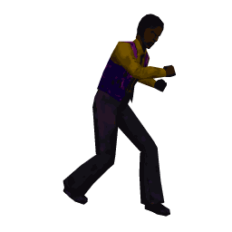{ width="64" } |
| 3 | `0x06b75f78` | `bopp_so1a` | `generic_header` | [130](characters.md#char-130) | 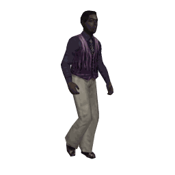{ width="64" } |
| 435 | `0x5a7dbb86` | `bopp_so1a_a` | `generic_header` |  | { width="64" } |
| 4 | `0x9fbe0ec2` | `bopp_so1b` | `generic_header` | [131](characters.md#char-131) | 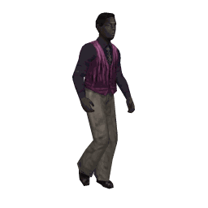{ width="64" } |
| 5 | `0xe8b93e54` | `bopp_so1c` | `generic_header` | [132](characters.md#char-132) | 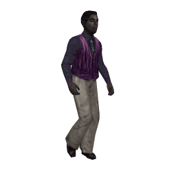{ width="64" } |
| 6 | `0x76ddabf7` | `bopp_so1d` | `generic_header` | [133](characters.md#char-133) | 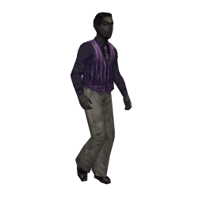{ width="64" } |
| 7 | `0x2d9a0cbb` | `bopp_so2a` | `generic_header` | [134](characters.md#char-134) | 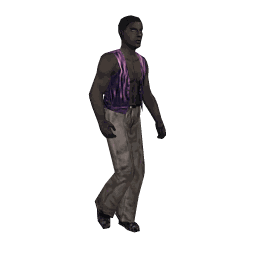{ width="64" } |
| 436 | `0x48c81468` | `bopp_so2a_a` | `generic_header` |  | 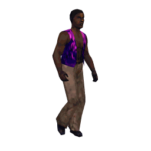{ width="64" } |
| 8 | `0x190060f4` | `char_db1` |  | [268](characters.md#char-268) | 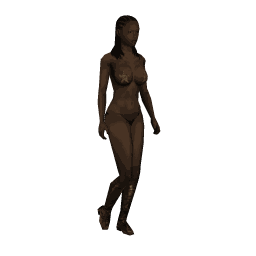{ width="64" } |
| 9 | `0x8009314e` | `char_db2` |  | [269](characters.md#char-269) | 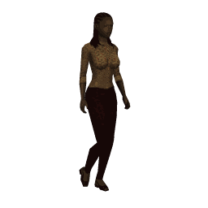{ width="64" } |
| 10 | `0xe48da58f` | `char_lcgf` |  | [205](characters.md#char-205) | 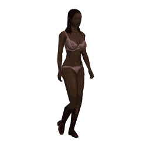{ width="64" } |
| 11 | `0xb5afb6d3` | `char_lcgf_vest` |  | [206](characters.md#char-206) | { width="64" } |
| 12 | `0xedb49427` | `char_wheels` | `turn_bd_header` | [97](characters.md#char-97), [459](characters.md#char-459) | 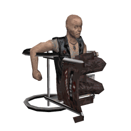{ width="64" } |
| 13 | `0x14b92786` | `civl_abe` | `generic_header` | [121](characters.md#char-121) | 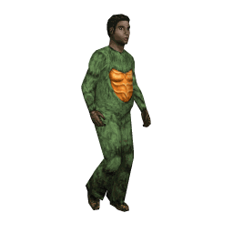{ width="64" } |
| 14 | `0x9497b4fd` | `civl_bm_va1` | `civl_bm_header` | [270](characters.md#char-270), [285](characters.md#char-285) | 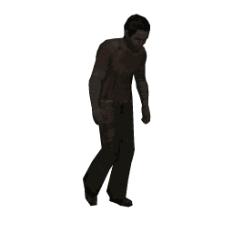{ width="64" } |
| 15 | `0x0d9ee547` | `civl_bm_va2` |  | [271](characters.md#char-271), [282](characters.md#char-282) | 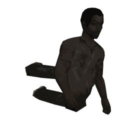{ width="64" } |
| 16 | `0xbfbae73e` | `civl_bm_vb1` | `civl_bm_header` | [272](characters.md#char-272) | 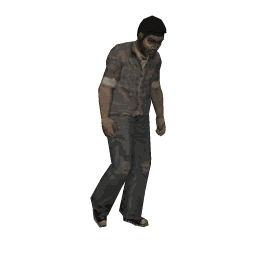{ width="64" } |
| 25 | `0x420248fb` | `civl_bm_vb11` |  | [281](characters.md#char-281), [287](characters.md#char-287) | 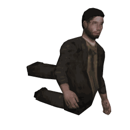{ width="64" } |
| 17 | `0x26b3b684` | `civl_bm_vb2` |  | [273](characters.md#char-273), [286](characters.md#char-286) | 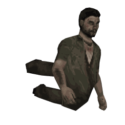{ width="64" } |
| 18 | `0x51b48612` | `civl_bm_vb3` | `civl_bm_header` | [274](characters.md#char-274) | { width="64" } |
| 19 | `0xcfd013b1` | `civl_bm_vb4` |  | [275](characters.md#char-275) | { width="64" } |
| 20 | `0xb8d72327` | `civl_bm_vb5` | `civl_bm_header` | [276](characters.md#char-276), [283](characters.md#char-283) | 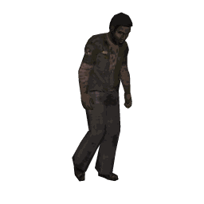{ width="64" } |
| 21 | `0x21de729d` | `civl_bm_vb6` |  | [277](characters.md#char-277) | { width="64" } |
| 22 | `0x56d9420b` | `civl_bm_vb7` | `civl_bm_header` | [278](characters.md#char-278) | 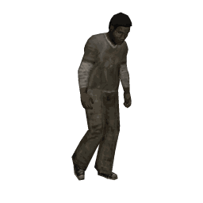{ width="64" } |
| 23 | `0xc6665f9a` | `civl_bm_vb8` |  | [279](characters.md#char-279), [284](characters.md#char-284) | 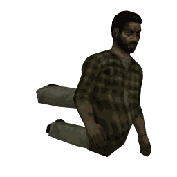{ width="64" } |
| 24 | `0xb1616f0c` | `civl_bm_vb9` | `civl_bm_header` | [280](characters.md#char-280) | 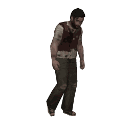{ width="64" } |
| 26 | `0xcf116d5d` | `civl_bn_fa1` |  | [368](characters.md#char-368) | 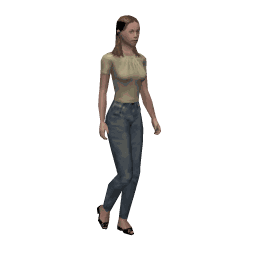{ width="64" } |
| 27 | `0x56183ce7` | `civl_bn_fa2` |  | [369](characters.md#char-369) | 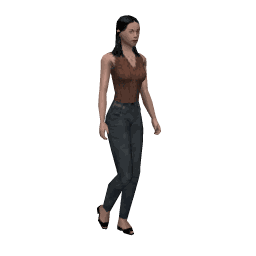{ width="64" } |
| 28 | `0x211f0c71` | `civl_bn_fa3` |  | [370](characters.md#char-370) | { width="64" } |
| 29 | `0xbf7b99d2` | `civl_bn_fa4` |  | [371](characters.md#char-371) | 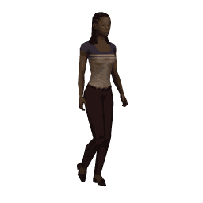{ width="64" } |
| 30 | `0xc34482bc` | `civl_bn_ma1` | `generic_header` | [372](characters.md#char-372), [377](characters.md#char-377) | 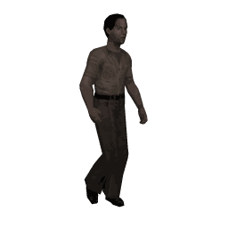{ width="64" } |
| 31 | `0x5a4dd306` | `civl_bn_ma2` | `generic_header` | [373](characters.md#char-373), [378](characters.md#char-378) | 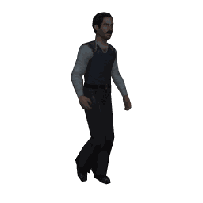{ width="64" } |
| 32 | `0x2d4ae390` | `civl_bn_ma3` | `generic_header` | [374](characters.md#char-374), [379](characters.md#char-379) | { width="64" } |
| 33 | `0xb32e7633` | `civl_bn_ma4` | `generic_header` | [375](characters.md#char-375) | 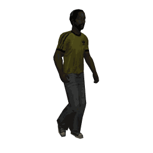{ width="64" } |
| 34 | `0xe869d17f` | `civl_bn_mb1` | `civl_bm_header` | [376](characters.md#char-376) | 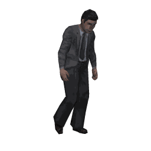{ width="64" } |
| 35 | `0x6661b9e5` | `civl_bt1` | `generic_header` | [343](characters.md#char-343) | { width="64" } |
| 36 | `0x65f232c3` | `civl_ch` | `generic_header` | [303](characters.md#char-303), [455](characters.md#char-455) | { width="64" } |
| 82 | `0x1da31044` | `civl_co_di` | `generic_header` | [291](characters.md#char-291), [441](characters.md#char-441) | { width="64" } |
| 83 | `0xf4c0b571` | `civl_co_do` | `generic_header` | [292](characters.md#char-292) | { width="64" } |
| 80 | `0x48d88717` | `civl_co_ic` | `generic_header` | [289](characters.md#char-289) | 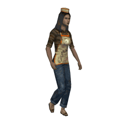{ width="64" } |
| 437 | `0x3010d867` | `civl_co_ic_a` | `generic_header` |  | 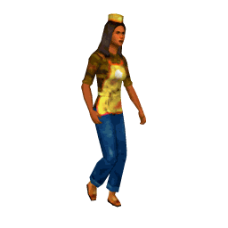{ width="64" } |
| 37 | `0x7bfb8459` | `civl_co_lf1` | `generic_header` | [300](characters.md#char-300) | 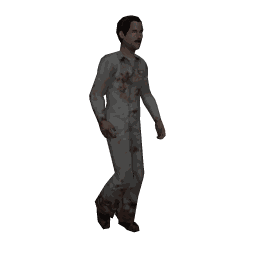{ width="64" } |
| 38 | `0xe2f2d5e3` | `civl_co_lf2` | `generic_header` | [301](characters.md#char-301) | 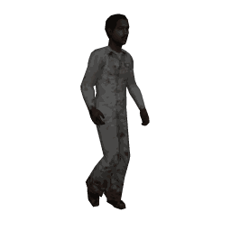{ width="64" } |
| 39 | `0x95f5e575` | `civl_co_lf3` | `generic_header` | [302](characters.md#char-302) | { width="64" } |
| 40 | `0x357878a9` | `civl_co_ma1` | `generic_header` | [417](characters.md#char-417) | 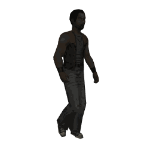{ width="64" } |
| 41 | `0xac712913` | `civl_co_ma2` | `generic_header` | [418](characters.md#char-418) | 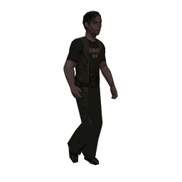{ width="64" } |
| 42 | `0xdb761985` | `civl_co_ma3` | `generic_header` | [419](characters.md#char-419) | 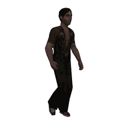{ width="64" } |
| 43 | `0x45128c26` | `civl_co_ma4` | `generic_header` | [420](characters.md#char-420) | { width="64" } |
| 44 | `0x3215bcb0` | `civl_co_ma5` | `generic_header` | [421](characters.md#char-421) | { width="64" } |
| 81 | `0x6f27a444` | `civl_co_sh` | `generic_header` | [290](characters.md#char-290) | 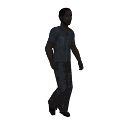{ width="64" } |
| 45 | `0xaaeab1d4` | `civl_csg` |  | [306](characters.md#char-306) | 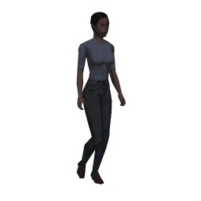{ width="64" } |
| 46 | `0x0719dd81` | `civl_ct_ac` | `generic_header` | [415](characters.md#char-415) | { width="64" } |
| 53 | `0xd2391bba` | `civl_ct_ck1` | `generic_header` | [411](characters.md#char-411) | 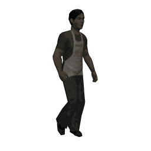{ width="64" } |
| 438 | `0xd2005f4d` | `civl_ct_ck1_a` | `generic_header` |  | { width="64" } |
| 54 | `0x4b304a00` | `civl_ct_ck2` | `generic_header` | [412](characters.md#char-412) | { width="64" } |
| 55 | `0x3c377a96` | `civl_ct_ck3` | `generic_header` | [413](characters.md#char-413) | 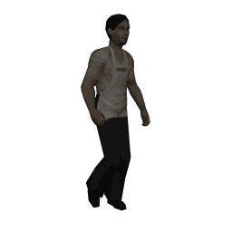{ width="64" } |
| 47 | `0x14722813` | `civl_ct_eb` | `generic_header` | [414](characters.md#char-414) | 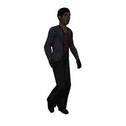{ width="64" } |
| 56 | `0x2e1d31db` | `civl_ct_fa1` |  | [402](characters.md#char-402) | 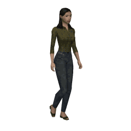{ width="64" } |
| 439 | `0x755d3059` | `civl_ct_fa1_a` |  |  | 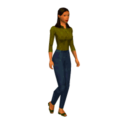{ width="64" } |
| 57 | `0xb7146061` | `civl_ct_fa2` |  | [404](characters.md#char-404) | 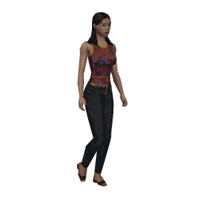{ width="64" } |
| 58 | `0xc01350f7` | `civl_ct_fa3` |  | [406](characters.md#char-406) | 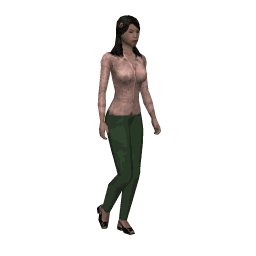{ width="64" } |
| 59 | `0x5e77c554` | `civl_ct_fa4` |  | [408](characters.md#char-408) | 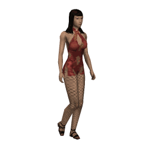{ width="64" } |
| 48 | `0x2248de3a` | `civl_ct_ma1` | `generic_header` | [118](characters.md#char-118), [403](characters.md#char-403) | { width="64" } |
| 440 | `0x028d0148` | `civl_ct_ma1_a` | `generic_header` |  | 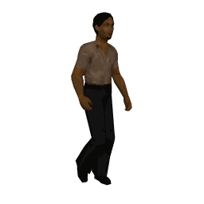{ width="64" } |
| 49 | `0xbb418f80` | `civl_ct_ma2` | `generic_header` | [405](characters.md#char-405) | 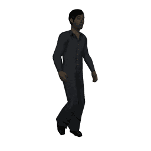{ width="64" } |
| 50 | `0xcc46bf16` | `civl_ct_ma3` | `generic_header` | [407](characters.md#char-407) | 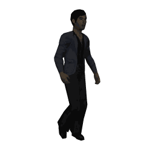{ width="64" } |
| 51 | `0x52222ab5` | `civl_ct_ma4` | `generic_header` | [409](characters.md#char-409) | { width="64" } |
| 52 | `0x25251a23` | `civl_ct_ma5` | `generic_header` | [410](characters.md#char-410) | { width="64" } |
| 60 | `0x65e8a4ea` | `civl_cw_ma1` | `generic_header` | [296](characters.md#char-296) | 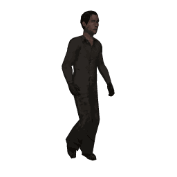{ width="64" } |
| 61 | `0xfce1f550` | `civl_cw_ma2` | `generic_header` | [297](characters.md#char-297) | 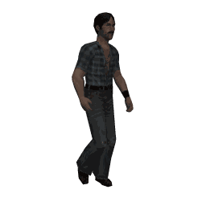{ width="64" } |
| 62 | `0x4ec5f729` | `civl_cw_mb1` | `generic_header` | [298](characters.md#char-298) | { width="64" } |
| 63 | `0xd7cca693` | `civl_cw_mb2` | `generic_header` | [299](characters.md#char-299) | { width="64" } |
| 64 | `0xb00d1b22` | `civl_dr_ma1` | `generic_header` | [426](characters.md#char-426) | { width="64" } |
| 65 | `0x29044a98` | `civl_dr_ma2` | `generic_header` | [427](characters.md#char-427) | { width="64" } |
| 66 | `0x5e037a0e` | `civl_dr_ma3` | `generic_header` | [429](characters.md#char-429) | { width="64" } |
| 67 | `0xc067efad` | `civl_dr_ma4` | `generic_header` | [428](characters.md#char-428) | { width="64" } |
| 68 | `0xb760df3b` | `civl_dr_ma5` | `generic_header` | [430](characters.md#char-430) | { width="64" } |
| 69 | `0x5d54a845` | `civl_eh_fa1` |  | [380](characters.md#char-380) | { width="64" } |
| 70 | `0xc45df9ff` | `civl_eh_fa2` |  | [381](characters.md#char-381) | { width="64" } |
| 71 | `0xb35ac969` | `civl_eh_fa3` |  | [382](characters.md#char-382) | { width="64" } |
| 72 | `0x510147a4` | `civl_eh_ma1` | `generic_header` | [383](characters.md#char-383) | { width="64" } |
| 73 | `0xc808161e` | `civl_eh_ma2` | `generic_header` | [384](characters.md#char-384) | { width="64" } |
| 74 | `0xbf0f2688` | `civl_eh_ma3` | `generic_header` | [385](characters.md#char-385) | { width="64" } |
| 75 | `0x216bb32b` | `civl_eh_ma4` | `generic_header` | [386](characters.md#char-386) | { width="64" } |
| 76 | `0x566c83bd` | `civl_eh_ma5` | `generic_header` | [387](characters.md#char-387) | { width="64" } |
| 84 | `0x97a9c263` | `civl_gc_bt` | `generic_header` | [321](characters.md#char-321) | { width="64" } |
| 77 | `0x9897a67d` | `civl_gk` | `generic_header` | [288](characters.md#char-288) | { width="64" } |
| 78 | `0xb6742be8` | `civl_gypsy` |  | [312](characters.md#char-312) | { width="64" } |
| 79 | `0x8fb0a723` | `civl_hd` | `generic_header` | [315](characters.md#char-315) | { width="64" } |
| 448 | `0xb054cc30` | `civl_hd_a` | `generic_header` |  | { width="64" } |
| 85 | `0x4b2cf0fb` | `civl_hl_b1` | `generic_header` | [293](characters.md#char-293) | { width="64" } |
| 86 | `0xd225a141` | `civl_hl_b2` | `generic_header` | [294](characters.md#char-294) | { width="64" } |
| 87 | `0xa52291d7` | `civl_hl_b3` | `generic_header` | [295](characters.md#char-295) | { width="64" } |
| 88 | `0x72acf415` | `civl_hl_br1` |  | [316](characters.md#char-316) | { width="64" } |
| 449 | `0xcb2aa017` | `civl_hl_br1_a` |  |  | { width="64" } |
| 89 | `0xeba5a5af` | `civl_hl_br2` |  | [317](characters.md#char-317) | { width="64" } |
| 450 | `0xc96c1e4e` | `civl_hl_br2_a` |  |  | { width="64" } |
| 90 | `0x9ca29539` | `civl_hl_br3` |  | [318](characters.md#char-318) | { width="64" } |
| 91 | `0x02c6009a` | `civl_hl_br4` |  | [319](characters.md#char-319) | { width="64" } |
| 92 | `0x75c1300c` | `civl_hl_br5` |  | [320](characters.md#char-320) | { width="64" } |
| 93 | `0xecc861b6` | `civl_hl_br6` |  |  | { width="64" } |
| 111 | `0x24f65393` | `civl_hl_bt1` | `generic_header` | [344](characters.md#char-344) | { width="64" } |
| 112 | `0xbdff0229` | `civl_hl_bt2` | `generic_header` | [345](characters.md#char-345) | { width="64" } |
| 113 | `0xcaf832bf` | `civl_hl_bt3` | `generic_header` | [346](characters.md#char-346) | { width="64" } |
| 114 | `0x549ca71c` | `civl_hl_bt4` | `generic_header` | [347](characters.md#char-347) | { width="64" } |
| 115 | `0x239b978a` | `civl_hl_bt5` | `generic_header` | [348](characters.md#char-348), [349](characters.md#char-349) | { width="64" } |
| 116 | `0xf43a10fe` | `civl_hl_dj1` | `generic_header` | [350](characters.md#char-350) | { width="64" } |
| 441 | `0xd1c72ac7` | `civl_hl_dj1_a` | `generic_header` |  | { width="64" } |
| 94 | `0xbb7b8639` | `civl_hl_dm1` | `generic_header` | [322](characters.md#char-322) | { width="64" } |
| 95 | `0x2272d783` | `civl_hl_dm2` | `generic_header` | [323](characters.md#char-323) | { width="64" } |
| 101 | `0x3f674e98` | `civl_hl_fb1` |  | [329](characters.md#char-329) | { width="64" } |
| 102 | `0xa66e1f22` | `civl_hl_fb2` |  | [330](characters.md#char-330) | { width="64" } |
| 106 | `0x267c7fd9` | `civl_hl_fc1` |  | [338](characters.md#char-338) | { width="64" } |
| 442 | `0xd60f362d` | `civl_hl_fc1_a` |  |  | { width="64" } |
| 107 | `0xbf752e63` | `civl_hl_fc2` |  | [339](characters.md#char-339) | { width="64" } |
| 443 | `0xd4498874` | `civl_hl_fc2_a` |  |  | { width="64" } |
| 108 | `0xc8721ef5` | `civl_hl_fc3` |  | [340](characters.md#char-340) | { width="64" } |
| 444 | `0xd58be243` | `civl_hl_fc3_a` |  |  | { width="64" } |
| 109 | `0x56168b56` | `civl_hl_fc4` |  | [341](characters.md#char-341) | { width="64" } |
| 445 | `0xd0c4f4c6` | `civl_hl_fc4_a` |  |  | { width="64" } |
| 110 | `0x2111bbc0` | `civl_hl_fc5` |  | [342](characters.md#char-342) | { width="64" } |
| 103 | `0x80571ddf` | `civl_hl_ho1` | `hooker_header` | [331](characters.md#char-331) | { width="64" } |
| 104 | `0x195e4c65` | `civl_hl_ho2` | `hooker_header` | [332](characters.md#char-332), [335](characters.md#char-335) | { width="64" } |
| 96 | `0x181ff2ba` | `civl_hl_ma1` | `generic_header` | [324](characters.md#char-324) | { width="64" } |
| 446 | `0x0bd6cfb7` | `civl_hl_ma1_a` | `generic_header` |  | { width="64" } |
| 97 | `0x8116a300` | `civl_hl_ma2` | `generic_header` | [325](characters.md#char-325) | { width="64" } |
| 98 | `0xf6119396` | `civl_hl_ma3` | `generic_header` | [326](characters.md#char-326) | { width="64" } |
| 447 | `0x08521bd9` | `civl_hl_ma3_a` | `generic_header` |  | { width="64" } |
| 99 | `0x68750635` | `civl_hl_ma4` | `generic_header` | [327](characters.md#char-327) | { width="64" } |
| 100 | `0x1f7236a3` | `civl_hl_ma5` | `generic_header` | [328](characters.md#char-328) | { width="64" } |
| 117 | `0x6930ba14` | `civl_hl_st1a` |  | [353](characters.md#char-353) | { width="64" } |
| 451 | `0x4355e65d` | `civl_hl_st1a_a` |  |  | { width="64" } |
| 118 | `0xf039ebae` | `civl_hl_st1b` |  | [354](characters.md#char-354) | { width="64" } |
| 452 | `0x41135804` | `civl_hl_st1b_a` |  |  | { width="64" } |
| 119 | `0x421de9d7` | `civl_hl_st2a` |  | [355](characters.md#char-355) | { width="64" } |
| 453 | `0x51e049b3` | `civl_hl_st2a_a` |  |  | { width="64" } |
| 120 | `0xdb14b86d` | `civl_hl_st2b` |  | [356](characters.md#char-356) | { width="64" } |
| 454 | `0x53a6f7ea` | `civl_hl_st2b_a` |  |  | { width="64" } |
| 121 | `0x5b06d896` | `civl_hl_st3a` |  | [357](characters.md#char-357) | { width="64" } |
| 105 | `0xb8615506` | `civl_hl_tr` |  | [337](characters.md#char-337) | { width="64" } |
| 122 | `0x69eca809` | `civl_hud` | `generic_header` | [65](characters.md#char-65), [244](characters.md#char-244), [336](characters.md#char-336), [352](characters.md#char-352) | { width="64" } |
| 125 | `0x6512e48b` | `civl_monk1` | `sava_bo_header` | [114](characters.md#char-114) | { width="64" } |
| 126 | `0xfc1bb531` | `civl_monk2` | `sava_bo_header` | [115](characters.md#char-115) | { width="64" } |
| 123 | `0xf89b829a` | `civl_monk_bo1` | `sava_bo_header` | [116](characters.md#char-116) | { width="64" } |
| 124 | `0x6192d320` | `civl_monk_bo2` | `sava_bo_header` | [117](characters.md#char-117) | { width="64" } |
| 129 | `0x73799da7` | `civl_pimp1` | `generic_header` | [442](characters.md#char-442), [444](characters.md#char-444) | { width="64" } |
| 130 | `0xea70cc1d` | `civl_pimp2` | `generic_header` | [443](characters.md#char-443) | { width="64" } |
| 131 | `0xa2339b14` | `civl_pl_dr` | `generic_header` |  | { width="64" } |
| 132 | `0xfbcf9dad` | `civl_pl_fa1` |  | [366](characters.md#char-366) | { width="64" } |
| 133 | `0x62c6cc17` | `civl_pl_fa2` |  | [367](characters.md#char-367) | { width="64" } |
| 134 | `0xf79a724c` | `civl_pl_ma1` | `generic_header` | [360](characters.md#char-360) | { width="64" } |
| 135 | `0x6e9323f6` | `civl_pl_ma2` | `generic_header` | [361](characters.md#char-361) | { width="64" } |
| 136 | `0x19941360` | `civl_pl_ma3` | `generic_header` | [362](characters.md#char-362) | { width="64" } |
| 138 | `0xf0f7b655` | `civl_pl_ma5` | `generic_header` | [363](characters.md#char-363) | { width="64" } |
| 139 | `0x69fee7ef` | `civl_pl_ma6` | `generic_header` | [364](characters.md#char-364) | { width="64" } |
| 141 | `0x8e46cae8` | `civl_pl_ma8` | `generic_header` | [365](characters.md#char-365) | { width="64" } |
| 143 | `0x019541b4` | `civl_pl_pm` | `generic_header` | [445](characters.md#char-445) | { width="64" } |
| 144 | `0x49be7eae` | `civl_pl_sp` | `generic_header` |  | { width="64" } |
| 145 | `0xd6971a22` | `civl_pl_st1` | `generic_header` | [422](characters.md#char-422) | { width="64" } |
| 146 | `0x4f9e4b98` | `civl_pl_st2` | `generic_header` | [423](characters.md#char-423) | { width="64" } |
| 147 | `0x38997b0e` | `civl_pl_st3` | `generic_header` | [424](characters.md#char-424) | { width="64" } |
| 148 | `0x400f5f41` | `civl_pl_we` | `generic_header` |  | { width="64" } |
| 152 | `0xd4d8f1ee` | `civl_prom_fa` |  | [310](characters.md#char-310) | { width="64" } |
| 153 | `0x4dd1a054` | `civl_prom_fb` |  | [311](characters.md#char-311) | { width="64" } |
| 150 | `0x372c2825` | `civl_prom_ma` | `generic_header` | [308](characters.md#char-308) | { width="64" } |
| 151 | `0xae25799f` | `civl_prom_mb` | `generic_header` | [309](characters.md#char-309) | { width="64" } |
| 154 | `0x54b73cf5` | `civl_rs_fa1` |  | [451](characters.md#char-451) | { width="64" } |
| 155 | `0xcdbe6d4f` | `civl_rs_fa2` |  | [452](characters.md#char-452) | { width="64" } |
| 156 | `0xbab95dd9` | `civl_rs_fa3` |  | [453](characters.md#char-453) | { width="64" } |
| 157 | `0x58e2d314` | `civl_rs_ma1` | `generic_header` | [446](characters.md#char-446) | { width="64" } |
| 158 | `0xc1eb82ae` | `civl_rs_ma2` | `generic_header` | [447](characters.md#char-447) | { width="64" } |
| 159 | `0xb6ecb238` | `civl_rs_ma3` | `generic_header` | [448](characters.md#char-448) | { width="64" } |
| 160 | `0x2888279b` | `civl_rs_ma4` | `generic_header` | [449](characters.md#char-449) | { width="64" } |
| 161 | `0x5f8f170d` | `civl_rs_ma5` | `generic_header` | [450](characters.md#char-450) | { width="64" } |
| 162 | `0xd3a6430e` | `civl_scps` | `generic_header` | [425](characters.md#char-425) | { width="64" } |
| 127 | `0x1a6a3130` | `civl_sg1` |  | [265](characters.md#char-265), [358](characters.md#char-358) | { width="64" } |
| 128 | `0x8363608a` | `civl_sg2` |  | [359](characters.md#char-359) | { width="64" } |
| 163 | `0xd5398bef` | `civl_sk_pe` | `generic_header` | [304](characters.md#char-304), [456](characters.md#char-456) | { width="64" } |
| 164 | `0xffbbb1ce` | `civl_sp_ju` | `generic_header` | [307](characters.md#char-307) | { width="64" } |
| 165 | `0xd41e7a61` | `civl_sp_ma1` | `generic_header` | [432](characters.md#char-432) | { width="64" } |
| 170 | `0xd41e7a61` | `civl_sp_ma1` | `generic_header` | [432](characters.md#char-432) | { width="64" } |
| 171 | `0xd41e7a61` | `civl_sp_ma1` | `generic_header` | [432](characters.md#char-432) | { width="64" } |
| 166 | `0x4d172bdb` | `civl_sp_ma2` | `generic_header` | [434](characters.md#char-434) | { width="64" } |
| 167 | `0x3a101b4d` | `civl_sp_ma3` | `generic_header` | [433](characters.md#char-433) | { width="64" } |
| 168 | `0xa4748eee` | `civl_sp_ma4` | `generic_header` | [435](characters.md#char-435) | { width="64" } |
| 169 | `0xd373be78` | `civl_sp_ma5` | `generic_header` | [431](characters.md#char-431) | { width="64" } |
| 172 | `0x3b317cdd` | `civl_st` | `generic_header` | [416](characters.md#char-416), [454](characters.md#char-454) | { width="64" } |
| 175 | `0xd85e7f30` | `civl_tr_cw` | `generic_header` | [388](characters.md#char-388) | { width="64" } |
| 176 | `0xbf8ef658` | `civl_tr_fa1` |  | [389](characters.md#char-389) | { width="64" } |
| 177 | `0x2687a7e2` | `civl_tr_fa2` |  | [390](characters.md#char-390) | { width="64" } |
| 178 | `0x51809774` | `civl_tr_fa3` |  | [391](characters.md#char-391) | { width="64" } |
| 179 | `0xcfe402d7` | `civl_tr_fa4` |  | [392](characters.md#char-392) | { width="64" } |
| 180 | `0xb3db19b9` | `civl_tr_ma1` | `generic_header` | [393](characters.md#char-393), [398](characters.md#char-398) | { width="64" } |
| 181 | `0x2ad24803` | `civl_tr_ma2` | `generic_header` | [394](characters.md#char-394) | { width="64" } |
| 182 | `0x5dd57895` | `civl_tr_ma3` | `generic_header` | [395](characters.md#char-395), [399](characters.md#char-399) | { width="64" } |
| 183 | `0xc3b1ed36` | `civl_tr_ma4` | `generic_header` | [396](characters.md#char-396), [400](characters.md#char-400) | { width="64" } |
| 184 | `0xb4b6dda0` | `civl_tr_ma5` | `generic_header` | [397](characters.md#char-397), [401](characters.md#char-401) | { width="64" } |
| 185 | `0xed79bba0` | `civl_tw` | `generic_header` | [305](characters.md#char-305), [457](characters.md#char-457) | { width="64" } |
| 186 | `0xe78f2085` | `civl_we_ma1` | `generic_header` | [437](characters.md#char-437) | { width="64" } |
| 187 | `0x7e86713f` | `civl_we_ma2` | `generic_header` | [436](characters.md#char-436) | { width="64" } |
| 188 | `0x098141a9` | `civl_we_ma3` | `generic_header` | [438](characters.md#char-438) | { width="64" } |
| 189 | `0x97e5d40a` | `civl_we_ma4` | `generic_header` | [439](characters.md#char-439) | { width="64" } |
| 190 | `0xe0e2e49c` | `civl_we_ma5` | `generic_header` | [440](characters.md#char-440) | { width="64" } |
| 205 | `0x0ab86664` | `cops_ia1` |  | [261](characters.md#char-261) | { width="64" } |
| 206 | `0x93b137de` | `cops_ia2` |  | [262](characters.md#char-262) | { width="64" } |
| 191 | `0x0fe74e73` | `cops_ty_va1` |  | [245](characters.md#char-245), [249](characters.md#char-249) | { width="64" } |
| 192 | `0x96ee1fc9` | `cops_ty_va2` |  | [246](characters.md#char-246), [250](characters.md#char-250) | { width="64" } |
| 193 | `0x24ca1db0` | `cops_ty_vb1` |  | [247](characters.md#char-247), [251](characters.md#char-251) | { width="64" } |
| 194 | `0xbdc34c0a` | `cops_ty_vb2` |  | [248](characters.md#char-248), [252](characters.md#char-252) | { width="64" } |
| 204 | `0x2db25ef2` | `cops_uc1` |  | [260](characters.md#char-260) | { width="64" } |
| 195 | `0x1dc28229` | `cops_va1` |  | [253](characters.md#char-253) | { width="64" } |
| 196 | `0x84cbd393` | `cops_va2` |  | [254](characters.md#char-254) | { width="64" } |
| 197 | `0xf3cce305` | `cops_va3` |  | [255](characters.md#char-255) | { width="64" } |
| 198 | `0x36efd1ea` | `cops_vb1` |  | [256](characters.md#char-256), [266](characters.md#char-266) | { width="64" } |
| 199 | `0xafe68050` | `cops_vb2` |  | [257](characters.md#char-257) | { width="64" } |
| 200 | `0xd8e1b0c6` | `cops_vb3` |  | [258](characters.md#char-258) | { width="64" } |
| 201 | `0x2ff4e0ab` | `cops_vc1` |  | [259](characters.md#char-259), [267](characters.md#char-267) | { width="64" } |
| 202 | `0x60b5766c` | `cops_vd1` |  | [263](characters.md#char-263) | { width="64" } |
| 203 | `0xf9bc27d6` | `cops_vd2` |  | [264](characters.md#char-264) | { width="64" } |
| 207 | `0x0da598d4` | `dest_bo` | `dest_bo_header` | [178](characters.md#char-178) | { width="64" } |
| 455 | `0x5dcf1462` | `dest_bo_a` | `dest_bo_header` |  | { width="64" } |
| 208 | `0x95803202` | `dest_bo_tg` | `dest_lt_header` | [179](characters.md#char-179) | { width="64" } |
| 210 | `0x8db7f82f` | `dest_cl` | `warr_cl_header` | [189](characters.md#char-189) | { width="64" } |
| 217 | `0x1bb21614` | `dest_le_bare` | `dest_lt_header` | [187](characters.md#char-187) | { width="64" } |
| 211 | `0x19437cb6` | `dest_lt` | `dest_lt_header` | [180](characters.md#char-180), [207](characters.md#char-207) | { width="64" } |
| 215 | `0x5f3e8806` | `dest_lt_be` | `dest_lt_header` | [185](characters.md#char-185), [213](characters.md#char-213) | { width="64" } |
| 456 | `0xf376f100` | `dest_lt_be_a` | `dest_lt_header` |  | { width="64" } |
| 229 | `0x2602e54b` | `dest_lt_hr` | `dest_lt_header` | [181](characters.md#char-181) | { width="64" } |
| 216 | `0xc1bda588` | `dest_lt_le` | `dest_lt_header` | [186](characters.md#char-186), [212](characters.md#char-212) | { width="64" } |
| 457 | `0x13a98633` | `dest_lt_le_a` | `dest_lt_header` |  | { width="64" } |
| 212 | `0x1d96cabe` | `dest_lt_v1` | `dest_lt_header` | [182](characters.md#char-182) | { width="64" } |
| 213 | `0x849f9b04` | `dest_lt_v2` | `dest_lt_header` | [183](characters.md#char-183) | { width="64" } |
| 458 | `0x45fe09fd` | `dest_lt_v2_a` | `dest_lt_header` |  | { width="64" } |
| 214 | `0xf398ab92` | `dest_lt_v3` | `dest_lt_header` | [184](characters.md#char-184) | { width="64" } |
| 219 | `0x4e1462b1` | `dest_so1a` |  | [192](characters.md#char-192), [208](characters.md#char-208) | { width="64" } |
| 459 | `0x182dd333` | `dest_so1a_a` |  |  | { width="64" } |
| 224 | `0x7713fa9f` | `dest_so1a_drnk` | `civl_bm_header` | [201](characters.md#char-201) | { width="64" } |
| 230 | `0x02030811` | `dest_so1a_hr` |  | [193](characters.md#char-193) | { width="64" } |
| 220 | `0xd71d330b` | `dest_so1b` |  | [194](characters.md#char-194), [209](characters.md#char-209) | { width="64" } |
| 225 | `0xf1878831` | `dest_so1b_drnk` | `civl_bm_header` | [202](characters.md#char-202) | { width="64" } |
| 231 | `0x10b6a7ff` | `dest_so1b_hr` |  | [195](characters.md#char-195) | { width="64" } |
| 221 | `0xa01a039d` | `dest_so1c` |  | [196](characters.md#char-196) | { width="64" } |
| 460 | `0x1ba9075d` | `dest_so1c_a` |  |  | { width="64" } |
| 222 | `0x65393172` | `dest_so2a` |  | [197](characters.md#char-197), [210](characters.md#char-210) | { width="64" } |
| 461 | `0x0a987cdd` | `dest_so2a_a` |  |  | { width="64" } |
| 226 | `0x46fbe002` | `dest_so2a_drnk` | `civl_bm_header` | [204](characters.md#char-204) | { width="64" } |
| 232 | `0x45a372c1` | `dest_so2a_hr` |  | [198](characters.md#char-198) | { width="64" } |
| 223 | `0xfc3060c8` | `dest_so2b` |  | [199](characters.md#char-199), [211](characters.md#char-211) | { width="64" } |
| 227 | `0xc06f92ac` | `dest_so2b_drnk` | `civl_bm_header` | [203](characters.md#char-203) | { width="64" } |
| 233 | `0x5716dd2f` | `dest_so2b_hr` |  | [200](characters.md#char-200) | { width="64" } |
| 228 | `0xc3dea69f` | `dest_ve` | `warr_ve_header` | [191](characters.md#char-191) | { width="64" } |
| 234 | `0xed2f341a` | `dj` |  | [351](characters.md#char-351) | { width="64" } |
| 235 | `0xaeb3cfac` | `elec_bo` | `generic_header` | [172](characters.md#char-172) | { width="64" } |
| 462 | `0x4f2680dd` | `elec_bo_a` | `generic_header` |  | { width="64" } |
| 236 | `0xba552bce` | `elec_lt` | `generic_header` | [173](characters.md#char-173) | { width="64" } |
| 463 | `0xbf8abb7f` | `elec_lt_a` | `generic_header` |  | { width="64" } |
| 237 | `0x41f67afc` | `elec_so1` | `generic_header` | [174](characters.md#char-174) | { width="64" } |
| 464 | `0x4e9675cf` | `elec_so1_a` | `generic_header` |  | { width="64" } |
| 238 | `0xd8ff2b46` | `elec_so2` | `generic_header` | [175](characters.md#char-175) | { width="64" } |
| 465 | `0x4cd0cb96` | `elec_so2_a` | `generic_header` |  | { width="64" } |
| 239 | `0xaff81bd0` | `elec_so3` | `generic_header` | [176](characters.md#char-176) | { width="64" } |
| 240 | `0x319c8e73` | `elec_so4` | `generic_header` | [177](characters.md#char-177) | { width="64" } |
| 241 | `0x56e67a0b` | `fury_bo` | `fury_bo_header` | [89](characters.md#char-89) | { width="64" } |
| 466 | `0x156b15a5` | `fury_bo_a` | `generic_header` |  | { width="64" } |
| 242 | `0x42009e69` | `fury_lt` | `fury_lt_header` | [90](characters.md#char-90) | { width="64" } |
| 467 | `0xe5c72e07` | `fury_lt_a` | `fury_lt_header` |  | { width="64" } |
| 243 | `0x09bc1902` | `fury_so1` |  | [91](characters.md#char-91) | { width="64" } |
| 468 | `0x1012c154` | `fury_so1_a` |  |  | { width="64" } |
| 244 | `0x90b548b8` | `fury_so2` |  | [92](characters.md#char-92), [95](characters.md#char-95) | { width="64" } |
| 469 | `0x12547f0d` | `fury_so2_a` |  |  | { width="64" } |
| 245 | `0xe7b2782e` | `fury_so3` |  | [93](characters.md#char-93) | { width="64" } |
| 246 | `0x79d6ed8d` | `fury_so4` |  | [94](characters.md#char-94) | { width="64" } |
| 247 | `0xcd3033e5` | `hiha_bo` | `hiha_bo_header` | [135](characters.md#char-135) | { width="64" } |
| 470 | `0xda96a925` | `hiha_bo_a` | `hiha_bo_header` |  | { width="64" } |
| 248 | `0xd9d6d787` | `hiha_lt` | `hiha_lt_header` | [136](characters.md#char-136) | { width="64" } |
| 471 | `0x2a3a9287` | `hiha_lt_a` | `hiha_lt_header` |  | { width="64" } |
| 249 | `0xb9dde07e` | `hiha_lt_ft` | `hiha_lt_header` | [137](characters.md#char-137) | { width="64" } |
| 472 | `0x57f90d77` | `hiha_lt_ft_a` | `hiha_lt_header` |  | { width="64" } |
| 250 | `0xfafb3dd5` | `hiha_so_va1` | `generic_header` | [138](characters.md#char-138) | { width="64" } |
| 473 | `0xe268851a` | `hiha_so_va1_a` | `generic_header` |  | { width="64" } |
| 251 | `0x63f26c6f` | `hiha_so_va2` | `generic_header` | [139](characters.md#char-139) | { width="64" } |
| 252 | `0xd1d66e16` | `hiha_so_vb1` | `generic_header` | [140](characters.md#char-140) | { width="64" } |
| 474 | `0xf0dd2af4` | `hiha_so_vb1_a` | `generic_header` |  | { width="64" } |
| 253 | `0x48df3fac` | `hiha_so_vb2` | `generic_header` | [141](characters.md#char-141) | { width="64" } |
| 254 | `0xc2aaafa9` | `hook_01` | `hooker_header` | [333](characters.md#char-333) | { width="64" } |
| 256 | `0x2ca4ce85` | `hook_03` | `hooker_header` | [334](characters.md#char-334) | { width="64" } |
| 258 | `0x6757c8cf` | `hurr_de` | `hurr_de_header` | [120](characters.md#char-120) | { width="64" } |
| 475 | `0x9f92e4fe` | `hurr_de_a` | `hurr_de_header` |  | { width="64" } |
| 260 | `0xc53e6235` | `hurr_lt` | `hurr_lt_header` | [123](characters.md#char-123) | { width="64" } |
| 476 | `0x47c20556` | `hurr_lt_a` | `hurr_lt_header` |  | { width="64" } |
| 261 | `0x65b98840` | `hurr_sa` | `hurr_lt_header` | [122](characters.md#char-122) | { width="64" } |
| 477 | `0x55552304` | `hurr_sa_a` | `hurr_lt_header` |  | { width="64" } |
| 262 | `0xa4b54827` | `hurr_so1a` |  | [124](characters.md#char-124) | { width="64" } |
| 478 | `0xe48dddd8` | `hurr_so1a_a` |  |  | { width="64" } |
| 263 | `0x3dbc199d` | `hurr_so1b` |  | [125](characters.md#char-125) | { width="64" } |
| 479 | `0xe6cb6381` | `hurr_so1b_a` |  |  | { width="64" } |
| 264 | `0x8f981be4` | `hurr_so2a` |  | [126](characters.md#char-126) | { width="64" } |
| 265 | `0x16914a5e` | `hurr_so2b` |  | [127](characters.md#char-127) | { width="64" } |
| 266 | `0x18ce7c05` | `hurr_va` | `hurr_va_header` | [119](characters.md#char-119) | { width="64" } |
| 480 | `0x628bd336` | `hurr_va_a` | `hurr_va_header` |  | { width="64" } |
| 267 | `0x48428484` | `jsbs_bo` | `generic_header` | [154](characters.md#char-154) | { width="64" } |
| 481 | `0xf375509e` | `jsbs_bo_a` | `generic_header` |  | { width="64" } |
| 268 | `0x5ca460e6` | `jsbs_lt` | `jsbs_lt_header` | [155](characters.md#char-155) | { width="64" } |
| 482 | `0x03d96b3c` | `jsbs_lt_a` | `jsbs_lt_header` |  | { width="64" } |
| 269 | `0x74a5234d` | `jsbs_so1` |  | [156](characters.md#char-156) | { width="64" } |
| 270 | `0xedac72f7` | `jsbs_so2` |  | [157](characters.md#char-157) | { width="64" } |
| 483 | `0xa3b9886c` | `jsbs_so2_a` |  |  | { width="64" } |
| 271 | `0x9aab4261` | `jsbs_so3` |  | [158](characters.md#char-158) | { width="64" } |
| 484 | `0xa27be25b` | `jsbs_so3_a` |  |  | { width="64" } |
| 272 | `0x04cfd7c2` | `jsbs_so4` |  | [159](characters.md#char-159) | { width="64" } |
| 273 | `0xeb4b0d2d` | `juda_bo` | `generic_header` | [166](characters.md#char-166) | { width="64" } |
| 274 | `0xffade94f` | `juda_lt` | `generic_header` | [167](characters.md#char-167) | { width="64" } |
| 275 | `0x79311666` | `juda_so_va1` | `generic_header` | [168](characters.md#char-168) | { width="64" } |
| 276 | `0xe03847dc` | `juda_so_va2` | `generic_header` | [169](characters.md#char-169) | { width="64" } |
| 277 | `0x521c45a5` | `juda_so_vb1` | `generic_header` | [170](characters.md#char-170) | { width="64" } |
| 278 | `0xcb15141f` | `juda_so_vb2` | `generic_header` | [171](characters.md#char-171) | { width="64" } |
| 279 | `0xa447038a` | `lizz_bo` | `lizz_bo_header` | [237](characters.md#char-237) | { width="64" } |
| 485 | `0x1e2a8796` | `lizz_bo_a` | `lizz_bo_header` |  | { width="64" } |
| 280 | `0xb0a1e7e8` | `lizz_lt` | `lizz_bo_header` | [238](characters.md#char-238) | { width="64" } |
| 486 | `0xee86bc34` | `lizz_lt_a` | `lizz_bo_header` |  | { width="64" } |
| 281 | `0xe9c509dd` | `lizz_so_va1` | `lizz_bo_header` | [239](characters.md#char-239) | { width="64" } |
| 487 | `0x0b05e899` | `lizz_so_va1_a` | `lizz_bo_header` |  | { width="64" } |
| 282 | `0x70cc5867` | `lizz_so_va2` | `lizz_bo_header` | [240](characters.md#char-240) | { width="64" } |
| 488 | `0x094356c0` | `lizz_so_va2_a` | `lizz_bo_header` |  | { width="64" } |
| 283 | `0x07cb68f1` | `lizz_so_va3` | `lizz_bo_header` | [241](characters.md#char-241) | { width="64" } |
| 284 | `0xc2e85a1e` | `lizz_so_vb1` | `lizz_bo_header` | [242](characters.md#char-242) | { width="64" } |
| 285 | `0x5be10ba4` | `lizz_so_vb2` | `lizz_bo_header` | [243](characters.md#char-243) | { width="64" } |
| 286 | `0xa3123319` | `moon_bo` | `generic_header` | [214](characters.md#char-214) | { width="64" } |
| 489 | `0x629f69b6` | `moon_bo_a` | `generic_header` |  | { width="64" } |
| 287 | `0xb7f4d77b` | `moon_lt` | `moon_lt_header` | [215](characters.md#char-215) | { width="64" } |
| 490 | `0x92335214` | `moon_lt_a` | `moon_lt_header` |  | { width="64" } |
| 288 | `0x71441f65` | `moon_so1a` | `generic_header` | [216](characters.md#char-216) | { width="64" } |
| 491 | `0xd3cde1f9` | `moon_so1a_a` | `generic_header` |  | { width="64" } |
| 289 | `0xe84d4edf` | `moon_so1b` | `generic_header` | [217](characters.md#char-217) | { width="64" } |
| 290 | `0x5a694ca6` | `moon_so2a` | `generic_header` | [218](characters.md#char-218) | { width="64" } |
| 492 | `0xc1784e17` | `moon_so2a_a` | `generic_header` |  | { width="64" } |
| 291 | `0xc3601d1c` | `moon_so2b` | `generic_header` | [219](characters.md#char-219) | { width="64" } |
| 292 | `0x4c1e6cfa` | `orph_bo` | `generic_header` |  | { width="64" } |
| 294 | `0xcc537835` | `orph_bo_va1` | `generic_header` | [220](characters.md#char-220) | { width="64" } |
| 493 | `0xbaa0f541` | `orph_bo_va1_a` | `generic_header` |  | { width="64" } |
| 296 | `0x684dbe5c` | `orph_lt_va` | `generic_header` | [223](characters.md#char-223) | { width="64" } |
| 494 | `0x7c98e634` | `orph_lt_va_a` | `generic_header` |  | { width="64" } |
| 297 | `0xf144efe6` | `orph_lt_vb` | `generic_header` | [224](characters.md#char-224) | { width="64" } |
| 495 | `0x7ede586d` | `orph_lt_vb_a` | `generic_header` |  | { width="64" } |
| 298 | `0x2b53992b` | `orph_me` |  | [221](characters.md#char-221) | { width="64" } |
| 496 | `0xb9ecff70` | `orph_me_a` |  |  | { width="64" } |
| 299 | `0x2481f6ac` | `orph_me_vb` |  | [222](characters.md#char-222) | { width="64" } |
| 300 | `0x04d9a90b` | `orph_so_va1` | `generic_header` | [225](characters.md#char-225) | { width="64" } |
| 497 | `0x0ab1c4f4` | `orph_so_va1_a` | `generic_header` |  | { width="64" } |
| 301 | `0x9dd0f8b1` | `orph_so_va2` | `generic_header` | [226](characters.md#char-226) | { width="64" } |
| 498 | `0x08f77aad` | `orph_so_va2_a` | `generic_header` |  | { width="64" } |
| 302 | `0x2ff4fac8` | `orph_so_vb1` | `generic_header` | [227](characters.md#char-227) | { width="64" } |
| 303 | `0xb6fdab72` | `orph_so_vb2` | `generic_header` | [228](characters.md#char-228) | { width="64" } |
| 499 | `0x1a42d543` | `orph_so_vb2_a` | `generic_header` |  | { width="64" } |
| 304 | `0x7d0a461f` | `panz_bo` | `generic_header` | [148](characters.md#char-148) | { width="64" } |
| 305 | `0x69eca27d` | `panz_lt` | `generic_header` | [149](characters.md#char-149) | { width="64" } |
| 306 | `0xafd20c58` | `panz_so_va1` | `generic_header` | [150](characters.md#char-150) | { width="64" } |
| 307 | `0x36db5de2` | `panz_so_va2` | `generic_header` | [151](characters.md#char-151) | { width="64" } |
| 308 | `0x84ff5f9b` | `panz_so_vb1` | `generic_header` | [152](characters.md#char-152) | { width="64" } |
| 309 | `0x1df60e21` | `panz_so_vb2` | `generic_header` | [153](characters.md#char-153) | { width="64" } |
| 312 | `0x81bfbc7d` | `punchbag` | `punchbag_header` | [460](characters.md#char-460) | { width="64" } |
| 310 | `0x0de83668` | `punk_bo` | `generic_header` | [229](characters.md#char-229) | { width="64" } |
| 500 | `0x24d17b74` | `punk_bo_a` | `generic_header` |  | { width="64" } |
| 311 | `0x23710f31` | `punk_bo_vb` | `generic_header` | [230](characters.md#char-230) | { width="64" } |
| 313 | `0x190ed20a` | `punk_lt` | `generic_header` | [231](characters.md#char-231) | { width="64" } |
| 501 | `0xd47d40d6` | `punk_lt_a` | `generic_header` |  | { width="64" } |
| 315 | `0x370a0da7` | `punk_so1a` |  | [233](characters.md#char-233) | { width="64" } |
| 502 | `0xd9b86333` | `punk_so1a_a` |  |  | { width="64" } |
| 316 | `0xae035c1d` | `punk_so1b` |  | [234](characters.md#char-234) | { width="64" } |
| 503 | `0xdbfedd6a` | `punk_so1b_a` |  |  | { width="64" } |
| 317 | `0x1c275e64` | `punk_so2a` |  | [235](characters.md#char-235) | { width="64" } |
| 318 | `0x852e0fde` | `punk_so2b` |  | [236](characters.md#char-236) | { width="64" } |
| 319 | `0xbc2fa22f` | `riff_bo_va1` | `generic_header` | [64](characters.md#char-64) | { width="64" } |
| 504 | `0x6c8b442c` | `riff_bo_va1_a` | `generic_header` |  | { width="64" } |
| 321 | `0xc1b6f2ad` | `riff_cy` | `generic_header` | [62](characters.md#char-62) | { width="64" } |
| 322 | `0xb6699001` | `riff_cy_ghost` | `generic_header` | [63](characters.md#char-63) | { width="64" } |
| 506 | `0xaf5b16c6` | `riff_cy_ghost_a` | `generic_header` |  | { width="64" } |
| 323 | `0x8d368156` | `riff_em` | `generic_header` | [67](characters.md#char-67) | { width="64" } |
| 320 | `0x389f92df` | `riff_lt` | `riff_lt_header` | [66](characters.md#char-66) | { width="64" } |
| 505 | `0x5eee118d` | `riff_lt_a` | `riff_lt_header` |  | { width="64" } |
| 324 | `0x74a57311` | `riff_so_va1` |  | [68](characters.md#char-68), [70](characters.md#char-70) | { width="64" } |
| 507 | `0xdc9a7599` | `riff_so_va1_a` |  |  | { width="64" } |
| 325 | `0xedac22ab` | `riff_so_va2` |  | [69](characters.md#char-69) | { width="64" } |
| 508 | `0xdedccbc0` | `riff_so_va2_a` |  |  | { width="64" } |
| 327 | `0x5f8820d2` | `riff_so_vb1` |  | [71](characters.md#char-71) | { width="64" } |
| 328 | `0xc6817168` | `riff_so_vb2` |  | [72](characters.md#char-72) | { width="64" } |
| 329 | `0x46931193` | `riff_so_vc1` |  | [73](characters.md#char-73) | { width="64" } |
| 330 | `0xdf9a4029` | `riff_so_vc2` |  | [74](characters.md#char-74) | { width="64" } |
| 331 | `0xa89d70bf` | `riff_so_vc3` |  | [75](characters.md#char-75) | { width="64" } |
| 332 | `0x36f9e51c` | `riff_so_vc4` |  | [76](characters.md#char-76) | { width="64" } |
| 333 | `0x85ec4461` | `rogu_bo` | `rogu_bo_header` | [77](characters.md#char-77) | { width="64" } |
| 509 | `0x4b185829` | `rogu_bo_a` | `rogu_bo_header` |  | { width="64" } |
| 334 | `0x9ce0a294` | `rogu_bo_gun` | `rogu_bo_gun_header` | [79](characters.md#char-79) | { width="64" } |
| 510 | `0x6bba1390` | `rogu_bo_gun_a` | `rogu_bo_gun_header` |  | { width="64" } |
| 335 | `0x36c4eb5b` | `rogu_bo_vb` | `rogu_bo_header` | [78](characters.md#char-78) | { width="64" } |
| 336 | `0x910aa003` | `rogu_lt` | `generic_header` | [80](characters.md#char-80) | { width="64" } |
| 511 | `0xbbb4638b` | `rogu_lt_a` | `generic_header` |  | { width="64" } |
| 337 | `0x9cf421dd` | `rogu_so_va1` | `generic_header` | [81](characters.md#char-81) | { width="64" } |
| 512 | `0x3eb03552` | `rogu_so_va1_a` | `generic_header` |  | { width="64" } |
| 341 | `0x3890c439` | `rogu_so_va1_hr` | `generic_header` | [85](characters.md#char-85) | { width="64" } |
| 338 | `0x05fd7067` | `rogu_so_va2` | `generic_header` | [82](characters.md#char-82) | { width="64" } |
| 513 | `0x3cf68b0b` | `rogu_so_va2_a` | `generic_header` |  | { width="64" } |
| 342 | `0x2a256bd7` | `rogu_so_va2_hr` | `generic_header` | [86](characters.md#char-86) | { width="64" } |
| 339 | `0xb7d9721e` | `rogu_so_vb1` | `generic_header` | [83](characters.md#char-83) | { width="64" } |
| 343 | `0x7f30bee9` | `rogu_so_vb1_hr` | `generic_header` | [87](characters.md#char-87) | { width="64" } |
| 340 | `0x2ed023a4` | `rogu_so_vb2` | `generic_header` | [84](characters.md#char-84) | { width="64" } |
| 344 | `0x6d851107` | `rogu_so_vb2_hr` | `generic_header` | [88](characters.md#char-88) | { width="64" } |
| 345 | `0x6c8581ff` | `samo_bo` | `samo_bo_header` | [160](characters.md#char-160) | { width="64" } |
| 514 | `0x4fd420eb` | `samo_bo_a` | `samo_bo_header` |  | { width="64" } |
| 350 | `0x7863659d` | `samo_lt` | `samo_lt_header` | [161](characters.md#char-161) | { width="64" } |
| 515 | `0xbf781b49` | `samo_lt_a` | `samo_lt_header` |  | { width="64" } |
| 346 | `0x3be669d3` | `samo_so_va1` |  | [162](characters.md#char-162) | { width="64" } |
| 347 | `0xa2ef3869` | `samo_so_va2` |  | [163](characters.md#char-163) | { width="64" } |
| 348 | `0xd5e808ff` | `samo_so_va3` |  | [164](characters.md#char-164) | { width="64" } |
| 516 | `0xdbb0a202` | `samo_so_va3_a` |  |  | { width="64" } |
| 349 | `0x4b8c9d5c` | `samo_so_va4` |  | [165](characters.md#char-165) | { width="64" } |
| 517 | `0xdeffb487` | `samo_so_va4_a` |  |  | { width="64" } |
| 351 | `0x6eeaf69f` | `sara_bo` | `generic_header` | [142](characters.md#char-142) | { width="64" } |
| 352 | `0x7a0c12fd` | `sara_lt` | `generic_header` | [143](characters.md#char-143) | { width="64" } |
| 353 | `0xf793db6f` | `sara_so1a` | `generic_header` | [144](characters.md#char-144) | { width="64" } |
| 354 | `0x6e9a8ad5` | `sara_so1b` | `generic_header` | [145](characters.md#char-145) | { width="64" } |
| 355 | `0xdcbe88ac` | `sara_so2a` | `generic_header` | [146](characters.md#char-146) | { width="64" } |
| 356 | `0x45b7d916` | `sara_so2b` | `generic_header` | [147](characters.md#char-147) | { width="64" } |
| 357 | `0x9b6a505f` | `sava_bo` | `sava_bo_header` | [106](characters.md#char-106) | { width="64" } |
| 518 | `0x100789af` | `sava_bo_a` | `sava_bo_header` |  | { width="64" } |
| 358 | `0x8f8cb43d` | `sava_lt` | `sava_lt_header` | [107](characters.md#char-107) | { width="64" } |
| 359 | `0xdb3b2f12` | `sava_lt1` | `sava_lt_header` | [108](characters.md#char-108) | { width="64" } |
| 360 | `0x42327ea8` | `sava_lt2` | `sava_lt_header` | [109](characters.md#char-109) | { width="64" } |
| 520 | `0x972c2a42` | `sava_lt2_a` | `sava_lt_header` |  | { width="64" } |
| 519 | `0xe0abb20d` | `sava_lt_a` | `sava_lt_header` |  | { width="64" } |
| 361 | `0x03dcff7c` | `sava_so1a` |  | [110](characters.md#char-110) | { width="64" } |
| 521 | `0xe8c7d801` | `sava_so1a_a` |  |  | { width="64" } |
| 362 | `0x9ad5aec6` | `sava_so1b` |  | [111](characters.md#char-111) | { width="64" } |
| 363 | `0x28f1acbf` | `sava_so2a` |  | [112](characters.md#char-112) | { width="64" } |
| 364 | `0xb1f8fd05` | `sava_so2b` |  | [113](characters.md#char-113) | { width="64" } |
| 365 | `0xfcbb4142` | `turn_bd` | `turn_bd_header` | [96](characters.md#char-96), [458](characters.md#char-458) | { width="64" } |
| 366 | `0xf48f62a4` | `turn_bd_gun` | `turn_bd_gun_header` | [98](characters.md#char-98) | { width="64" } |
| 367 | `0x6b6998ca` | `turn_bo` | `turn_lt_header` | [99](characters.md#char-99) | { width="64" } |
| 368 | `0x7f8f7ca8` | `turn_lt` | `turn_lt_header` | [100](characters.md#char-100) | { width="64" } |
| 369 | `0xe5e264c6` | `turn_so1` |  | [101](characters.md#char-101) | { width="64" } |
| 370 | `0x7ceb357c` | `turn_so2` |  | [102](characters.md#char-102) | { width="64" } |
| 371 | `0x0bec05ea` | `turn_so3` |  | [103](characters.md#char-103) | { width="64" } |
| 372 | `0x95889049` | `turn_so4` |  | [104](characters.md#char-104) | { width="64" } |
| 373 | `0xe28fa0df` | `turn_so5` |  | [105](characters.md#char-105) | { width="64" } |
| 374 | `0x834e8db1` | `warr_aj` | `warr_aj_header` | [11](characters.md#char-11) | { width="64" } |
| 522 | `0x2898e180` | `warr_aj_a` | `warr_aj_header` |  | { width="64" } |
| 376 | `0xb4c242c7` | `warr_aj_cv` | `warr_aj_header` | [13](characters.md#char-13) | { width="64" } |
| 531 | `0x5cf85b8f` | `warr_aj_fury` | `warr_aj_header` |  | { width="64" } |
| 375 | `0x1b5adfcd` | `warr_aj_gen` | `generic_header` | [12](characters.md#char-12) | { width="64" } |
| 377 | `0x89334219` | `warr_aj_ghost` | `warr_aj_header` | [14](characters.md#char-14) | { width="64" } |
| 378 | `0xbfa36701` | `warr_cb` | `warr_cb_header` | [18](characters.md#char-18) | { width="64" } |
| 523 | `0x8c8278b3` | `warr_cb_a` | `warr_cb_header` |  | { width="64" } |
| 379 | `0x0bb63948` | `warr_cb_cv` | `warr_cb_header` | [20](characters.md#char-20) | { width="64" } |
| 532 | `0x2734c8cb` | `warr_cb_fury` | `warr_cb_header` |  | { width="64" } |
| 380 | `0x66e23507` | `warr_cb_gen` | `generic_header` | [19](characters.md#char-19) | { width="64" } |
| 381 | `0x581b4a06` | `warr_cl` | `warr_cl_header` | [1](characters.md#char-1) | { width="64" } |
| 430 | `0x3d68db66` | `warr_cl_chase` | `warr_cl_chase_header` | [4](characters.md#char-4) | { width="64" } |
| 540 | `0xcfcd11dc` | `warr_cl_chase_fury` | `warr_cl_chase_header` |  | { width="64" } |
| 533 | `0x1d3ea9bb` | `warr_cl_fury` | `warr_cl_header` |  | { width="64" } |
| 382 | `0xd9d28b66` | `warr_cl_gen` | `generic_header` | [2](characters.md#char-2) | { width="64" } |
| 383 | `0xa8c6705e` | `warr_cl_ghost` | `generic_header` | [3](characters.md#char-3) | { width="64" } |
| 524 | `0x3272ab8a` | `warr_cl_ghost_a` | `generic_header` |  | { width="64" } |
| 384 | `0xc1121bbc` | `warr_co` | `warr_co_header` | [15](characters.md#char-15) | { width="64" } |
| 525 | `0x845aebe0` | `warr_co_a` | `warr_co_header` |  | { width="64" } |
| 386 | `0xf9dce195` | `warr_co_cv` | `warr_co_header` | [17](characters.md#char-17) | { width="64" } |
| 534 | `0x9baadb15` | `warr_co_fury` | `warr_co_header` |  | { width="64" } |
| 385 | `0x9e72f1b6` | `warr_co_gen` | `generic_header` | [16](characters.md#char-16) | { width="64" } |
| 387 | `0xf42d3b4a` | `warr_dest_le` | `dest_lt_header` | [61](characters.md#char-61) | { width="64" } |
| 388 | `0xbc65eff9` | `warr_fo` | `warr_fo_header` | [21](characters.md#char-21) | { width="64" } |
| 389 | `0x538dc52e` | `warr_fo_cv1` | `warr_fo_header` | [23](characters.md#char-23) | { width="64" } |
| 390 | `0xca849494` | `warr_fo_cv2` | `warr_fo_header` | [24](characters.md#char-24) | { width="64" } |
| 535 | `0xc992f4b2` | `warr_fo_fury` | `warr_fo_header` |  | { width="64" } |
| 391 | `0xcebf6005` | `warr_fo_gen` | `generic_header` | [22](characters.md#char-22) | { width="64" } |
| 392 | `0xd1ce64a7` | `warr_fo_ghost` | `generic_header` | [25](characters.md#char-25) | { width="64" } |
| 526 | `0xedd65c0b` | `warr_fo_ghost_a` | `generic_header` |  | { width="64" } |
| 393 | `0x67d79063` | `warr_jn` | `generic_header` | [41](characters.md#char-41) | { width="64" } |
| 395 | `0xb25eb222` | `warr_ly` | `generic_header` | [45](characters.md#char-45) | { width="64" } |
| 399 | `0xb8291b35` | `warr_ma` | `generic_header` | [43](characters.md#char-43) | { width="64" } |
| 401 | `0x721ed1b2` | `warr_re` | `warr_re_header` | [30](characters.md#char-30) | { width="64" } |
| 527 | `0x61685ecc` | `warr_re_a` | `warr_re_header` |  | { width="64" } |
| 402 | `0xcbe1bfc3` | `warr_re_cv` | `warr_re_header` | [32](characters.md#char-32) | { width="64" } |
| 536 | `0xfb986f09` | `warr_re_fury` | `warr_re_header` |  | { width="64" } |
| 403 | `0x1c483829` | `warr_re_gen` | `generic_header` | [31](characters.md#char-31) | { width="64" } |
| 404 | `0xfcd7397b` | `warr_sn` | `warr_sn_header` | [33](characters.md#char-33) | { width="64" } |
| 528 | `0xd581d648` | `warr_sn_a` | `warr_sn_header` |  | { width="64" } |
| 431 | `0xd64cfb64` | `warr_sn_chase` | `warr_sn_chase_header` | [36](characters.md#char-36) | { width="64" } |
| 541 | `0x97f12999` | `warr_sn_chase_fury` | `warr_sn_chase_header` |  | { width="64" } |
| 405 | `0x21801172` | `warr_sn_cv` | `warr_sn_header` | [35](characters.md#char-35) | { width="64" } |
| 537 | `0x3728947e` | `warr_sn_fury` | `warr_sn_header` |  | { width="64" } |
| 406 | `0xa0c4da9d` | `warr_sn_gen` | `generic_header` | [34](characters.md#char-34) | { width="64" } |
| 407 | `0x1ff8b30b` | `warr_so_va1` | `generic_header` | [49](characters.md#char-49) | { width="64" } |
| 413 | `0xfb55298b` | `warr_so_va1_hr` | `generic_header` | [55](characters.md#char-55) | { width="64" } |
| 408 | `0x86f1e2b1` | `warr_so_va2` | `generic_header` | [50](characters.md#char-50) | { width="64" } |
| 414 | `0xe9e08665` | `warr_so_va2_hr` | `generic_header` | [56](characters.md#char-56) | { width="64" } |
| 409 | `0xf1f6d227` | `warr_so_va3` | `generic_header` | [51](characters.md#char-51) | { width="64" } |
| 415 | `0x515ce100` | `warr_so_va3_hr` | `generic_header` | [57](characters.md#char-57) | { width="64" } |
| 410 | `0x34d5e0c8` | `warr_so_vb1` | `generic_header` | [52](characters.md#char-52) | { width="64" } |
| 416 | `0xbcf5535b` | `warr_so_vb1_hr` | `generic_header` | [58](characters.md#char-58) | { width="64" } |
| 411 | `0xaddcb172` | `warr_so_vb2` | `generic_header` | [53](characters.md#char-53) | { width="64" } |
| 417 | `0xae40fcb5` | `warr_so_vb2_hr` | `generic_header` | [59](characters.md#char-59) | { width="64" } |
| 412 | `0xdadb81e4` | `warr_so_vb3` | `generic_header` | [54](characters.md#char-54) | { width="64" } |
| 418 | `0x16fc9bd0` | `warr_so_vb3_hr` | `generic_header` | [60](characters.md#char-60) | { width="64" } |
| 419 | `0x98bc91bb` | `warr_sw` | `warr_sw_header` | [5](characters.md#char-5) | { width="64" } |
| 529 | `0xc6764eb7` | `warr_sw_a` | `warr_sw_header` |  | { width="64" } |
| 432 | `0x240a2279` | `warr_sw_chase` | `warr_sw_chase_header` | [9](characters.md#char-9) | { width="64" } |
| 542 | `0x0640fef4` | `warr_sw_chase_fury` | `warr_sw_chase_header` |  | { width="64" } |
| 420 | `0x0c910967` | `warr_sw_cv` | `warr_sw_header` | [7](characters.md#char-7) | { width="64" } |
| 538 | `0x13f1c72d` | `warr_sw_fury` | `warr_sw_header` |  | { width="64" } |
| 421 | `0xcd342f6e` | `warr_sw_gen` | `generic_header` | [6](characters.md#char-6) | { width="64" } |
| 422 | `0xb1a48941` | `warr_sw_ghost` | `warr_sw_header` | [8](characters.md#char-8) | { width="64" } |
| 423 | `0x30452a7b` | `warr_ty` | `generic_header` | [38](characters.md#char-38) | { width="64" } |
| 425 | `0x5e6ea244` | `warr_ty_cv` | `generic_header` | [40](characters.md#char-40) | { width="64" } |
| 426 | `0x167214b6` | `warr_ve` | `warr_ve_header` | [26](characters.md#char-26), [28](characters.md#char-28) | { width="64" } |
| 530 | `0xee0ac99b` | `warr_ve_a` | `warr_ve_header` |  | { width="64" } |
| 427 | `0x3e611903` | `warr_ve_cv` | `warr_ve_header` | [29](characters.md#char-29) | { width="64" } |
| 539 | `0x0fd74b1a` | `warr_ve_fury` | `warr_ve_header` |  | { width="64" } |
| 428 | `0x87d97a3f` | `warr_ve_gen` | `generic_header` | [27](characters.md#char-27) | { width="64" } |
| 137 | `0x87f086c3` |  | `generic_header` |  | { width="64" } |
| 140 | `0x1ef9d779` |  | `generic_header` |  | { width="64" } |
| 142 | `0xf941fa7e` |  | `generic_header` |  | { width="64" } |
| 149 | `0x59fd14be` |  | `generic_header` |  | { width="64" } |
| 173 | `0x9ec10057` |  | `generic_header` |  | { width="64" } |
| 174 | `0x07c851ed` |  | `generic_header` |  | { width="64" } |
| 209 | `0x6a0fd528` |  | `warr_cb_header` |  | { width="64" } |
| 218 | `0x297b8b52` |  | `warr_sn_header` |  | { width="64" } |
| 255 | `0x5ba3fe13` |  | `hooker_header` |  | { width="64" } |
| 257 | `0xd1d88657` |  | `hurr_lt_header` |  | { width="64" } |
| 259 | `0xea4b6425` |  | `hurr_de_header` |  | { width="64" } |
| 293 | `0xc7b064ef` |  | `generic_header` |  | { width="64" } |
| 295 | `0x555a298f` |  | `generic_header` |  | { width="64" } |
| 314 | `0xf4a52e90` |  |  |  | { width="64" } |
| 326 | `0x9aab123d` |  |  |  | { width="64" } |
| 394 | `0x4c70e481` |  | `generic_header` |  | { width="64" } |
| 396 | `0xe77d0edb` |  | `generic_header` |  | { width="64" } |
| 397 | `0x1db6846a` |  | `generic_header` |  | { width="64" } |
| 398 | `0x84bfd5d0` |  | `generic_header` |  | { width="64" } |
| 400 | `0xa63328c7` |  | `generic_header` |  | { width="64" } |
| 424 | `0xb7edd298` |  | `generic_header` |  | { width="64" } |
| 429 | `0x47f80e38` |  | `generic_header` |  | { width="64" } |

## Sources and evidence

Evidence levels used: confirmed-code.

- warriors.glr, Character List (chunk 0x44)

## Fields

| Field | Type | Hand-written | Meaning |
| --- | --- | --- | --- |
| `index` | int |  | Position in the Character List (stable for the NTSC-U disc). |
| `crc` | hex |  | CRC-32 of the model name, lower case: what the game looks up. |
| `name` | str |  | The model name, when recovered. |
| `data` | str |  | Name of the character data resource (animations and anim table), when recovered. |
| `data_crc` | hex |  | Hash naming the character data resource. |
| `geo_crc` | hex |  | Hash naming the model resource; the name is `<model>_geo`. |
| `tex_crc` | hex |  | Hash naming the texture dictionary; the name is `<model>_tex`. |
| `data_size` | int |  | Size of the character data in bytes. |
| `geo_size` | int |  | Size of the model resource in bytes. |
| `tex_size` | int |  | Size of the texture dictionary in bytes. |
| `types` | list |  | Character types (`CfgChar`) that use the model. |
| `image` | str |  | A thumbnail, a path below `docs/references/images/` (`characters/warr_re_cv.png`); set by extract from the files present. |
| `source` | str | yes | Where the entry comes from: a script and binding, an address, a chunk. |
| `evidence` | str | yes | How we know: confirmed-code, confirmed-runtime, inferred or speculative ([evidence levels](../guides/research-workflow.md#evidence-levels)). |
| `notes` | str | yes | Our own short notes. |
