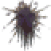
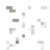
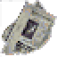
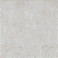
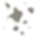

# Particle effects

<!-- Generated by `coney-tools refs render` from research/references/particles.yaml. Do not edit. -->

Every type of the script type table: the particle systems `SpawnParticle` makes, and the object
behaviours, lights and glass that share the table ([Particles](../research/particles.md)).

!!! info "What is complete"

    All 270 types are listed. The sprite is traced for 58 of them.

270 entries. Data: `research/references/particles.yaml`.

## glass {#glass}

1 entries.

| Name | Index |
| --- | --- |
| `glass_script` | 61 |

## particle system {#particle-system}

183 entries.

| Name | Image | Index | Sheet | Rect | Size (px) | Spawns | Script calls | Scripts | What |
| --- | --- | --- | --- | --- | --- | --- | --- | --- | --- |
| `blo_splat` | { width="96" } | 0 | `part_page1` | 5 | 32, 32 | | | | |
| `blood_drop` | { width="96" } | 1 | `part_page1` | 52 | 16, 16 | | | | |
| `blood_mist` | | 2 | | | | | | | |
| `blood_splat_ground` | | 3 | | | | | | | |
| `blood_splatter` | | 4 | | | | | | | |
| `blood_spray` | { width="96" } | 5 | `part_page1` | 52 | 16, 16 | | | | |
| `bloosh` | { width="96" } | 6 | `part_page1` | 46 | 40, 40 | | | | |
| `coplights_glow` | { width="96" } | 7 | `lighting` | 2 | 120, 120 | | | | |
| `coplights_lens_flare` | { width="96" } | 8 | `lighting` | 2 | 120, 120 | | | | |
| `fir` | | 59 | | | | | | | |
| `fir_group` | | 60 | | | | [fir](particles.md#part-fir) | | | |
| `glasstest` | | 62 | | | | | | | |
| `hud_radar_dot` | { width="96" } | 65 | `part_page0` | 69 | 10, 10 | | | | |
| `hud_text_widget` | | 66 | | | | | | | |
| `hud_widget` | | 67 | | | | | | | |
| `hud_widget_angled` | | 68 | | | | | | | |
| `miniglass` | | 70 | | | | | | | |
| `molotov_smoke` | | 71 | | | | | | | |
| `paint_splat` | | 75 | | | | | | | |
| `part_blood_spray` | | 76 | | | | | | | |
| `part_coke_machine` | | 77 | | | | | | | |
| `part_copcar_lights` | { width="96" } | 78 | `lighting` | 2 | 120, 120 | | | | |
| `part_explosion` | { width="96" } | 79 | `part_page1` | 6 | 64, 64 | | 4 | `level93_chapter6.lua` | |
| `part_explosion_screen_shake` | | 80 | | | | | 2 | `level93_chapter6.lua` | |
| `part_fear` | | 81 | | | | | 71 | `level115.lua`, `level31.lua`, `level61.lua`, `level63_orphans.lua`, `level81.lua`, `level93_chapter6.lua` | |
| `part_fire` | { width="96" } | 82 | `part_fire` | 0 | 40, 40 | | 7 | `level93_chapter6.lua` | |
| `part_fire_large` | { width="96" } | 83 | `part_fire` | 0 | 40, 40 | | 2 | `level34.lua` | |
| `part_fire_large_ns` | { width="96" } | 84 | `part_fire` | 0 | 40, 40 | | 2 | `level52_chapter1.lua` | |
| `part_fire_light_large` | | 85 | | | | | 1 | `level93_chapter6.lua` | |
| `part_fire_light_medium` | | 86 | | | | | 7 | `level52_chapter1.lua`, `level93_chapter6.lua` | |
| `part_fire_ns` | { width="96" } | 87 | `part_fire` | 0 | 40, 40 | | 2 | `level52_chapter1.lua` | |
| `part_fire_plume` | { width="96" } | 88 | `39640d4c` | 0 | 10, 30 | | 1 | `level80.lua` | |
| `part_fire_tiki` | { width="96" } | 89 | `part_fire` | 0 | 40, 40 | | | | |
| `part_firebarrel` | { width="96" } | 90 | `part_fire` | 0 | 40, 40 | | | | |
| `part_firebarrel_ns` | { width="96" } | 91 | `part_fire` | 0 | 40, 40 | | | | |
| `part_firetruck_lights` | { width="96" } | 92 | `lighting` | 2 | 120, 120 | | 1 | `level52.lua` | |
| `part_fog` | | 93 | | | | | | | |
| `part_garbage_flies` | | 94 | | | | | | | |
| `part_garbage_flies_ns` | | 95 | | | | | | | |
| `part_gasmeter` | | 96 | | | | | | | |
| `part_generator_sparks` | | 97 | | | | | | | |
| `part_ghost_light` | | 98 | | | | | | | |
| `part_gun_flash` | { width="96" } | 99 | `lighting` | 2 | 120, 120 | [sub_shack_puff](particles.md#part-sub-shack-puff) | | | |
| `part_large_ac` | | 100 | | | | | | | |
| `part_large_ac_two` | | 101 | | | | | | | |
| `part_lava_light` | | 102 | | | | | | | |
| `part_level2_subway` | | 103 | | | | | 1 | `level2.lua` | |
| `part_light_bugs` | | 104 | | | | | | | |
| `part_motorbike_gang` | | 105 | | | | | | | |
| `part_multi_strobe` | | 106 | | | | | 3 | `level11.lua`, `level110.lua` | |
| `part_narrowflame` | { width="96" } | 107 | `5e5e43c6` | 0 | 40, 40 | | 56 | `level52_chapter1.lua`, `level93_chapter6.lua` | |
| `part_ominous_smoke` | | 108 | | | | | 36 | `level51.lua`, `level52_chapter1.lua`, `level61.lua`, `level61_huns.lua`, `level64.lua`, `level81.lua` | |
| `part_open_air_vent` | | 109 | | | | | | | |
| `part_orange_neon` | | 110 | | | | | | | |
| `part_pelham_subway` | | 111 | | | | | | | |
| `part_pink_neon` | | 112 | | | | | | | |
| `part_plaster_drop` | | 113 | | | | | 4 | `level5.lua` | |
| `part_plaster_drop_ns` | | 114 | | | | | 2 | `level81_chatterbox.lua`, `level93_chapter6.lua` | |
| `part_raindrops` | | 115 | | | | [sub_ripple](particles.md#part-sub-ripple), [sub_splash](particles.md#part-sub-splash) | | | |
| `part_ridecart_sound` | | 116 | | | | | | | |
| `part_rotate_vent` | | 117 | | | | | | | |
| `part_s_fire` | { width="96" } | 118 | `part_fire` | 0 | 40, 40 | | | | |
| `part_s_shack_dust_puff` | | 119 | | | | [sub_shack_puff](particles.md#part-sub-shack-puff) | | | |
| `part_s_subway_sparks` | { width="96" } | 120 | `part_page1` | 54 | 32, 32 | | | | Sprite to recheck: the traced rectangle 54 shows a grey box, not this effect |
| `part_small_ac` | | 121 | | | | | | | |
| `part_small_light` | | 122 | | | | | 6 | `level14.lua`, `level81.lua` | |
| `part_smaller_light` | | 123 | | | | | | | |
| `part_spray_tag` | | 124 | | | | | 230 | `level107.lua`, `level11.lua`, `level122.lua`, `level14.lua`, `level2.lua`, `level20.lua` | |
| `part_squareflame_lrg` | { width="96" } | 125 | `5e5e43c6` | 0 | 40, 40 | | 54 | `level93_chapter6.lua` | |
| `part_squareflame_med` | { width="96" } | 126 | `5e5e43c6` | 0 | 40, 40 | | 27 | `level52_chapter1.lua`, `level93_chapter6.lua` | |
| `part_squareflame_sml` | { width="96" } | 127 | `5e5e43c6` | 0 | 40, 40 | | 1 | `level52_chapter1.lua` | |
| `part_steam` | | 128 | | | | | 18 | `level11.lua`, `level110.lua`, `level52.lua`, `level87.lua` | |
| `part_steam_huge` | | 129 | | | | | 1 | `level52.lua` | |
| `part_steam_large` | | 130 | | | | | 17 | `level52.lua` | |
| `part_strobe` | | 131 | | | | | 8 | `level11.lua`, `level110.lua`, `level81.lua` | |
| `part_strobe_red` | | 132 | | | | | 2 | `level93.lua` | |
| `part_subway_light` | | 133 | | | | | | | |
| `part_torch_flame` | { width="96" } | 134 | `part_fire` | 0 | 40, 40 | | 3 | `level86_chapter2_reg.lua` | |
| `part_torch_flame_ns` | { width="96" } | 135 | `part_fire` | 0 | 40, 40 | | | | |
| `part_truck_sound` | | 136 | | | | | 1 | `level51.lua` | |
| `part_truck_humans` | | 137 | | | | | 1 | `level51.lua` | |
| `part_train_sound` | | 138 | | | | | 16 | `level115.lua`, `level14.lua`, `level2.lua`, `level31.lua`, `level5.lua`, `level55_subway.lua` | |
| `part_train_splat` | { width="96" } | 139 | `part_page1` | 6 | 64, 64 | | | | |
| `part_trans_five` | | 140 | | | | | | | |
| `part_trans_four` | | 141 | | | | | | | |
| `part_trans_one` | | 142 | | | | | | | |
| `part_trans_three` | | 143 | | | | | | | |
| `part_trans_two` | | 144 | | | | | | | |
| `part_tv` | { width="96" } | 145 | `part_tv` | 0 | 30, 30 | | | | |
| `part_tv_light` | | 146 | | | | | | | |
| `part_urine_spray` | | 147 | | | | | | | |
| `part_urine_stain2` | { width="96" } | 148 | `part_page1` | 6 | 64, 64 | | | | |
| `part_water` | | 149 | | | | | | | |
| `pee_pee` | | 150 | | | | | | | |
| `pee_tracer` | | 151 | | | | | | | |
| `power_mist` | | 153 | | | | | | | |
| `puk_splat` | | 156 | | | | | | | |
| `rubble` | | 158 | | | | [sub_shack_puff](particles.md#part-sub-shack-puff) | | | |
| `spark` | { width="96" } | 161 | `part_page1` | 41 | 30, 30 | | | | |
| `spawn_delayed` | | 163 | | | | | | | |
| `spray_mist` | | 164 | | | | | | | |
| `sub_anim_notes` | | 167 | | | | [glasstest](particles.md#part-glasstest), [sub_wood_splinter](particles.md#part-sub-wood-splinter) | | | |
| `sub_anim_spark` | { width="96" } | 168 | `part_page1` | 50 | 16, 16 | | | | |
| `sub_barlamp_glow` | { width="96" } | 169 | `lighting` | 3 | 120, 120 | | | | |
| `sub_blight_glow` | { width="96" } | 171 | `lighting` | 3 | 120, 120 | | | | |
| `sub_blo` | | 172 | | | | | | | |
| `sub_blood_effect` | | 173 | | | | | | | |
| `sub_blood_gout` | { width="96" } | 174 | `part_page1` | 2 | 32, 32 | | | | |
| `sub_blood_gush` | | 175 | | | | | | | |
| `sub_blood_spray` | { width="96" } | 176 | `part_page1` | 6 | 64, 64 | | | | |
| `sub_burn` | | 177 | | | | | | | |
| `sub_car_damage` | | 178 | | | | [sub_shack_puff](particles.md#part-sub-shack-puff) | | | |
| `sub_car_rubble` | { width="96" } | 179 | `part_page1` | 24 | 32, 32 | | | | |
| `sub_car_spark_emitter` | | 180 | | | | | | | |
| `sub_car_sparks` | { width="96" } | 181 | `part_page1` | 45 | 16, 3 | | | | |
| `sub_car_steam` | | 182 | | | | | | | |
| `sub_car_steam_emitter` | | 183 | | | | | | | |
| `sub_coloured_glass` | | 184 | | | | | | | |
| `sub_coloured_shards` | | 185 | | | | | | | |
| `sub_debris` | | 186 | | | | | | | |
| `sub_detergent` | | 187 | | | | [sub_debris](particles.md#part-sub-debris), [sub_paint_splat](particles.md#part-sub-paint-splat), [sub_shack_puff](particles.md#part-sub-shack-puff) | | | |
| `sub_dus` | | 188 | | | | [sub_shack_puff](particles.md#part-sub-shack-puff) | | | |
| `sub_embers` | { width="96" } | 189 | `part_page1` | 20 | 64, 64 | | | | |
| `sub_explode` | { width="96" } | 190 | `part_page1` | 17 | 64, 64 | | | | |
| `sub_explosion_embers` | | 191 | | | | | | | |
| `sub_explosion_group` | | 193 | | | | | | | |
| `sub_fade_flame` | { width="96" } | 194 | `part_fire` | 0 | 40, 40 | | | | |
| `sub_fire` | | 195 | | | | | | | |
| `sub_fire_smoke` | { width="96" } | 197 | `part_page1` | 42 | 64, 64 | | | | |
| `sub_fire2` | | 198 | | | | | | | |
| `sub_fire2_smoke` | | 200 | | | | | | | |
| `sub_fireball` | | 201 | | | | | | | |
| `sub_fireball_emitter` | | 202 | | | | | 1 | `level93_chapter6.lua` | |
| `sub_flame_reflect` | { width="96" } | 204 | `part_fire` | 0 | 40, 40 | | | | |
| `sub_flames` | | 205 | | | | | | | |
| `sub_flaming_debris` | { width="96" } | 206 | `part_fire` | 0 | 40, 40 | | | | |
| `sub_flashing_light` | | 207 | | | | | | | |
| `sub_fog` | | 208 | | | | | | | |
| `sub_glass` | | 210 | | | | | | | |
| `sub_glint` | { width="96" } | 211 | `part_page1` | 41 | 30, 30 | | | | |
| `sub_glt` | | 212 | | | | | | | |
| `sub_gun` | | 213 | | | | | | | |
| `sub_hood_smoke` | | 214 | | | | | | | |
| `sub_molotv_flame` | | 216 | | | | | | | |
| `sub_muzzle_flash` | { width="96" } | 219 | `part_page1` | 35 | 16, 8 | | | | |
| `sub_objective_glow` | { width="96" } | 223 | `lighting` | 3 | 120, 120 | | | | |
| `sub_paint_splat` | | 225 | | | | | | | |
| `sub_pch` | | 226 | | | | | | | |
| `sub_pee` | | 227 | | | | | | | |
| `sub_pla` | | 228 | | | | | | | |
| `sub_plaster_drop` | | 229 | | | | | | | |
| `sub_polar_bugs` | { width="96" } | 230 | `part_page1` | 19 | 16, 16 | | | | |
| `sub_powerup_glow` | { width="96" } | 232 | `part_page1` | 29 | 64, 64 | | | | |
| `sub_puk` | | 233 | | | | | | | |
| `sub_punch_flash` | | 234 | | | | | | | |
| `sub_ripple` | | 235 | | | | | | | |
| `sub_rubble` | | 236 | | | | [rubble](particles.md#part-rubble) | | | |
| `sub_shack_puff` | { width="96" } | 237 | `part_page1` | 42 | 64, 64 | | | | |
| `sub_shack_puff_aligned` | { width="96" } | 238 | `part_page1` | 42 | 64, 64 | | | | |
| `sub_shk` | | 239 | | | | | | | |
| `sub_smk` | | 241 | | | | | | | |
| `sub_smoke` | | 242 | | | | | | | |
| `sub_spark_effect` | | 243 | | | | | | | |
| `sub_spk` | | 244 | | | | | | | |
| `sub_splash` | { width="96" } | 245 | `part_page1` | 51 | 16, 8 | | | | |
| `sub_spr` | | 246 | | | | | | | |
| `sub_stained_glass` | | 247 | | | | | | | |
| `sub_sweat_effect` | | 248 | | | | | | | |
| `sub_thrown_dust_puff` | { width="96" } | 251 | `part_page1` | 42 | 64, 64 | | | | |
| `sub_train_splat` | { width="96" } | 252 | `part_page1` | 2 | 32, 32 | | | | |
| `sub_train_splat_mist` | { width="96" } | 253 | `part_page1` | 6 | 64, 64 | | | | |
| `sub_triglint` | | 254 | | | | | | | |
| `sub_water` | | 256 | | | | | | | |
| `sub_wood_splinter` | | 257 | | | | [wood_splinter_bit](particles.md#part-wood-splinter-bit) | | | |
| `subway_lensflare` | { width="96" } | 258 | `cf4c87d3` | 0 | 102, 50 | | | | |
| `subway_loop` | | 260 | | | | | | | |
| `subway_spark` | { width="96" } | 261 | `part_page1` | 54 | 32, 32 | | | | Sprite to recheck: the traced rectangle 54 shows a grey box, not this effect |
| `sweat_drop` | | 263 | | | | | | | |
| `sweat_mist` | | 264 | | | | | | | |
| `sweat_spray` | | 265 | | | | | | | |
| `urine_spray` | { width="96" } | 267 | `part_page1` | 54 | 32, 32 | | | | Sprite to recheck: the traced rectangle 54 shows a grey box, not this effect |
| `Wind_Manager` | | 268 | | | | | | | |
| `wood_splinter_bit` | | 269 | | | | | | | |

## object behaviour {#object-behaviour}

64 entries.

| Name | Index | Spawns |
| --- | --- | --- |
| `dyn_animwave` | 9 | |
| `dyn_bar_lamp` | 10 | |
| `dyn_blaster` | 11 | [sub_debris](particles.md#part-sub-debris), [sub_rubble](particles.md#part-sub-rubble), [sub_shack_puff](particles.md#part-sub-shack-puff), [sub_spark_effect](particles.md#part-sub-spark-effect), [sub_wood_splinter](particles.md#part-sub-wood-splinter) |
| `dyn_blocker` | 12 | |
| `dyn_breakable_light` | 13 | [sub_rubble](particles.md#part-sub-rubble), [sub_shack_puff](particles.md#part-sub-shack-puff), [sub_spark_effect](particles.md#part-sub-spark-effect) |
| `dyn_cashreg` | 14 | |
| `dyn_cashreg_b` | 15 | |
| `dyn_cbradio` | 16 | [sub_rubble](particles.md#part-sub-rubble), [sub_shack_puff](particles.md#part-sub-shack-puff), [sub_spark_effect](particles.md#part-sub-spark-effect) |
| `dyn_chand` | 17 | |
| `dyn_chicken` | 18 | [sub_debris](particles.md#part-sub-debris), [sub_wood_splinter](particles.md#part-sub-wood-splinter) |
| `dyn_colasign` | 19 | |
| `dyn_ctrl_box` | 20 | [sub_rubble](particles.md#part-sub-rubble), [sub_shack_puff](particles.md#part-sub-shack-puff), [sub_spark_effect](particles.md#part-sub-spark-effect) |
| `dyn_disco_a` | 21 | |
| `dyn_disco_b` | 22 | |
| `dyn_door_bar_bani` | 23 | [sub_shack_puff](particles.md#part-sub-shack-puff), [sub_wood_splinter](particles.md#part-sub-wood-splinter) |
| `dyn_door_barricade` | 24 | |
| `dyn_door_bnstr` | 25 | [sub_shack_puff](particles.md#part-sub-shack-puff), [sub_wood_splinter](particles.md#part-sub-wood-splinter) |
| `dyn_door_chain_s` | 26 | |
| `dyn_door_fence` | 27 | [sub_shack_puff](particles.md#part-sub-shack-puff), [sub_wood_splinter](particles.md#part-sub-wood-splinter) |
| `dyn_door_fence_o` | 28 | [sub_shack_puff](particles.md#part-sub-shack-puff), [sub_wood_splinter](particles.md#part-sub-wood-splinter) |
| `dyn_door_parapet` | 29 | [sub_shack_puff](particles.md#part-sub-shack-puff), [sub_wood_splinter](particles.md#part-sub-wood-splinter) |
| `dyn_door_sliding` | 30 | |
| `dyn_scaffold` | 31 | |
| `dyn_door_swinging` | 32 | [sub_glass](particles.md#part-sub-glass), [sub_shack_puff](particles.md#part-sub-shack-puff), [sub_wood_splinter](particles.md#part-sub-wood-splinter) |
| `dyn_exploding_car` | 33 | |
| `dyn_fluor_swing` | 34 | |
| `dyn_icon` | 35 | |
| `dyn_lizzies` | 36 | [sub_shack_puff](particles.md#part-sub-shack-puff), [sub_wood_splinter](particles.md#part-sub-wood-splinter) |
| `dyn_lock_a` | 37 | |
| `dyn_manqheadred` | 38 | |
| `dyn_masks` | 39 | [sub_detergent](particles.md#part-sub-detergent), [sub_rubble](particles.md#part-sub-rubble), [sub_shack_puff](particles.md#part-sub-shack-puff), [sub_wood_splinter](particles.md#part-sub-wood-splinter) |
| `dyn_molotv` | 40 | |
| `dyn_motelneon` | 41 | |
| `dyn_neon_broken` | 42 | |
| `dyn_neon_onesided` | 43 | |
| `dyn_o_shore` | 44 | |
| `dyn_objective` | 45 | |
| `dyn_on_off` | 46 | |
| `dyn_oneon_glow` | 47 | |
| `dyn_outwave` | 48 | |
| `dyn_pile` | 49 | |
| `dyn_rat` | 50 | |
| `dyn_skullglow` | 51 | |
| `dyn_table` | 52 | [sub_shack_puff](particles.md#part-sub-shack-puff), [sub_wood_splinter](particles.md#part-sub-wood-splinter) |
| `dyn_walktalk` | 53 | [sub_shack_puff](particles.md#part-sub-shack-puff) |
| `dyn_wash_a` | 54 | |
| `dyn_wash_b` | 55 | |
| `dyn_wave` | 56 | |
| `dyn_woodbridge` | 57 | [sub_shack_puff](particles.md#part-sub-shack-puff) |
| `fade_object` | 58 | [sub_debris](particles.md#part-sub-debris) |
| `hat_object` | 64 | |
| `melee_weapon` | 69 | [sub_coloured_glass](particles.md#part-sub-coloured-glass), [sub_debris](particles.md#part-sub-debris), [sub_rubble](particles.md#part-sub-rubble), [sub_shack_puff](particles.md#part-sub-shack-puff), [sub_wood_splinter](particles.md#part-sub-wood-splinter), [wood_splinter_bit](particles.md#part-wood-splinter-bit) |
| `overhead_weapon` | 74 | [sub_debris](particles.md#part-sub-debris), [sub_detergent](particles.md#part-sub-detergent), [sub_paint_splat](particles.md#part-sub-paint-splat), [sub_rubble](particles.md#part-sub-rubble), [sub_shack_puff](particles.md#part-sub-shack-puff), [sub_spark_effect](particles.md#part-sub-spark-effect), [sub_wood_splinter](particles.md#part-sub-wood-splinter) |
| `pickup_item` | 152 | |
| `powerup_item` | 154 | [sub_glint](particles.md#part-sub-glint), [sub_powerup_glow](particles.md#part-sub-powerup-glow) |
| `float_item` | 155 | |
| `rotating_object` | 157 | |
| `simple_object` | 159 | [sub_rubble](particles.md#part-sub-rubble) |
| `sub_objective_column` | 222 | |
| `sub_oil_reflect` | 224 | |
| `sub_sliding_door` | 240 | |
| `sub_swinging_door` | 249 | |
| `sub_swinging_obj` | 250 | |
| `thrown_weapon` | 266 | [sub_coloured_glass](particles.md#part-sub-coloured-glass), [sub_debris](particles.md#part-sub-debris), [sub_detergent](particles.md#part-sub-detergent), [sub_rubble](particles.md#part-sub-rubble), [sub_shack_puff](particles.md#part-sub-shack-puff), [sub_wood_splinter](particles.md#part-sub-wood-splinter) |

## light {#light}

22 entries.

| Name | Index |
| --- | --- |
| `gun_light_flash` | 63 |
| `multi_strobe` | 72 |
| `on_off_light` | 73 |
| `small_light` | 160 |
| `spark_light_flash` | 162 |
| `strobe` | 165 |
| `strober` | 166 |
| `sub_blight` | 170 |
| `sub_explosion_light` | 192 |
| `sub_fire_light` | 196 |
| `sub_fire2_light` | 199 |
| `sub_firetruck_light` | 203 |
| `sub_ghost_light` | 209 |
| `sub_lava_light` | 215 |
| `sub_molotv_light` | 217 |
| `sub_moving_light` | 218 |
| `sub_neon_light` | 220 |
| `sub_neon_light2` | 221 |
| `sub_police_light` | 231 |
| `sub_tv_light` | 255 |
| `subway_light` | 259 |
| `subway_spark_light_flash` | 262 |

## Sources and evidence

Evidence levels used: confirmed-code, speculative.

- SLUS_212.15, script type table 0x00512f28

## Fields

| Field | Type | Hand-written | Meaning |
| --- | --- | --- | --- |
| `name` | str | | The type name `SpawnParticle` (or `CfgObj`'s class, for an object behaviour) takes. |
| `index` | int | | Position in the script type table (`0x00512f28`, 270 records of 20 bytes). |
| `kind` | str | | From the record's flags: particle system, object behaviour, light or glass. |
| `flags` | hex | | The record's flags word (`0x10` particle, `0x08` object, `0x04` light, `0x400` glass). |
| `init` | hex | | The type's initialiser (first code pointer of the record). |
| `sheet` | str | | The sprite sheet its sprite comes from, where traced. |
| `rect` | int | | The first rectangle of that sheet it draws, where traced. |
| `size` | list | | That rectangle's size in texels {w, h}, read from the disc. |
| `spawns` | list | | Other types its code spawns by name (inferred). |
| `calls` | int | | `SpawnParticle` calls that name it. |
| `scripts` | list | | The scripts that spawn it (at most six). |
| `meaning` | str | yes | What it is, in our words. |
| `image` | str | | A thumbnail, a path below `docs/references/images/` (`characters/warr_re_cv.png`); set by extract from the files present. |
| `source` | str | yes | Where the entry comes from: a script and binding, an address, a chunk. |
| `evidence` | str | yes | How we know: confirmed-code, confirmed-runtime, inferred or speculative ([evidence levels](../guides/research-workflow.md#evidence-levels)). |
| `notes` | str | yes | Our own short notes. |
